# 🎯 **Advanced AI Features Implementation Plan**
## Sophisticated Optimization Algorithms for Workflow Studio

---

## 📊 **Executive Summary**

This comprehensive plan outlines the implementation of **sophisticated AI optimization algorithms** for the Auterity Workflow Studio, transforming it into an intelligent, self-optimizing platform that learns, adapts, and continuously improves workflow performance while reducing costs and enhancing user experience.

### **🎯 Key Objectives**
- **25-45% cost reduction** through intelligent model selection and resource optimization
- **25-40% performance improvement** via AI-driven execution planning and bottleneck prevention
- **90%+ prediction accuracy** for cost and performance forecasting
- **Real-time optimization** with continuous learning and adaptation
- **Intelligent recommendations** powered by machine learning and pattern recognition

---

## 🧠 **Core AI Optimization Algorithms**

### **1. Multi-Objective Workflow Optimization Engine**

#### **Smart Execution Planning**
```typescript
interface WorkflowOptimizer {
  // Critical path analysis with ML-enhanced predictions
  analyzeCriticalPath(workflow: Workflow): Promise<ExecutionPlan>;
  
  // Parallel execution optimization using graph algorithms
  optimizeParallelExecution(nodes: Node[]): Promise<ParallelExecutionPlan>;
  
  // Dynamic resource allocation with predictive scaling
  optimizeResourceAllocation(workflow: Workflow): Promise<ResourcePlan>;
  
  // Bottleneck prediction and proactive mitigation
  predictBottlenecks(workflow: Workflow): Promise<BottleneckAnalysis>;
}
```

#### **Adaptive Execution Strategies**
- **Dynamic Load Balancing**: Real-time resource redistribution based on ML predictions
- **Intelligent Caching**: ML-driven cache optimization with usage pattern analysis
- **Predictive Scaling**: Proactive resource scaling using time-series forecasting
- **Circuit Breaker Intelligence**: Smart failure recovery with reinforcement learning

### **2. Advanced Cost Optimization AI Engine**

#### **Multi-Criteria Decision Making**
```typescript
interface CostOptimizationEngine {
  // Pareto-optimal model selection for competing objectives
  optimizeModelSelection(
    requirements: PerformanceRequirements,
    constraints: BudgetConstraints
  ): Promise<ModelRecommendation>;
  
  // Dynamic pricing with market analysis and usage forecasting
  optimizePricing(usage: UsagePattern): Promise<PricingStrategy>;
  
  // Portfolio optimization for budget allocation
  optimizeBudgetAllocation(projects: Project[]): Promise<BudgetPlan>;
  
  // ROI maximization using reinforcement learning
  maximizeROI(investments: Investment[]): Promise<OptimizationPlan>;
}
```

### **3. Intelligent Recommendation System**

#### **Machine Learning-Driven Insights**
```typescript
interface WorkflowRecommendationEngine {
  // Deep learning pattern recognition for workflow optimization
  analyzeWorkflowPatterns(workflows: Workflow[]): Promise<PatternAnalysis>;
  
  // Collaborative filtering with neural networks
  generateWorkflowSuggestions(user: User): Promise<WorkflowSuggestion[]>;
  
  // Anomaly detection using isolation forests and autoencoders
  detectWorkflowAnomalies(workflow: Workflow): Promise<AnomalyReport>;
  
  // Predictive maintenance with time-series analysis
  predictMaintenanceNeeds(workflow: Workflow): Promise<MaintenancePlan>;
}
```

### **4. Self-Learning Resource Management**

#### **Adaptive Resource Allocation**
```typescript
interface AdaptiveResourceManager {
  // Neural network-based resource prediction
  predictResourceNeeds(workflow: Workflow): Promise<ResourcePrediction>;
  
  // Reinforcement learning for dynamic scaling decisions
  optimizeScaling(metrics: PerformanceMetrics): Promise<ScalingDecision>;
  
  // Genetic algorithms for resource recycling optimization
  optimizeResourceRecycling(resources: Resource[]): Promise<RecyclingPlan>;
  
  // Multi-objective optimization for cost-performance balance
  balanceCostPerformance(constraints: Constraints): Promise<OptimalBalance>;
}
```

---

## 🏗️ **Implementation Architecture**

### **AI-Powered System Architecture**

```mermaid
graph TB
    subgraph "AI Optimization Layer"
        WO[Workflow Optimizer<br/>• Critical Path Analysis<br/>• Parallel Optimization<br/>• Bottleneck Prevention]
        CE[Cost Engine<br/>• Model Selection<br/>• Budget Optimization<br/>• ROI Maximization]
        RS[Recommendation System<br/>• Pattern Recognition<br/>• Collaborative Filtering<br/>• Anomaly Detection]
        RM[Resource Manager<br/>• Predictive Scaling<br/>• Adaptive Allocation<br/>• Intelligent Recycling]
    end
    
    subgraph "Machine Learning Models"
        PM[Performance Models<br/>• Gradient Boosting<br/>• Neural Networks<br/>• Time Series]
        CM[Cost Models<br/>• Linear Regression<br/>• Decision Trees<br/>• Reinforcement Learning]
        RM_ML[Recommendation Models<br/>• Deep Learning<br/>• Collaborative Filtering<br/>• NLP Processing]
        AM[Anomaly Models<br/>• Isolation Forest<br/>• Autoencoders<br/>• Statistical Methods]
    end
    
    subgraph "Real-time Processing"
        SP[Stream Processing<br/>• Real-time Metrics<br/>• Event Processing<br/>• Continuous Learning]
        OE[Optimization Engine<br/>• Live Optimization<br/>• A/B Testing<br/>• Feedback Loops]
        CP[Cache Layer<br/>• Prediction Cache<br/>• Model Cache<br/>• Result Cache]
    end
    
    subgraph "Integration Layer"
        AI[Auterity Integration<br/>• AutoMatrix<br/>• RelayCore<br/>• NeuroWeaver]
        WS[Workflow Studio<br/>• UI Components<br/>• Real-time Updates<br/>• User Feedback]
        API[API Gateway<br/>• Request Routing<br/>• Load Balancing<br/>• Authentication]
    end
    
    WO --> PM
    CE --> CM
    RS --> RM_ML
    RM --> AM
    
    PM --> SP
    CM --> OE
    RM_ML --> CP
    AM --> SP
    
    WO --> AI
    CE --> WS
    RS --> API
    RM --> AI
```



---

## 🎯 **Advanced Feature Categories**

### **1. Intelligent Workflow Optimization**

#### **Performance Enhancement Features**
- **🚀 Smart Execution Planning**: AI-driven execution order optimization using critical path analysis
- **⚡ Parallel Processing Intelligence**: Optimal parallelization strategies with dependency resolution
- **🎯 Resource Optimization**: Dynamic resource allocation with predictive scaling
- **💾 Intelligent Caching**: ML-driven caching strategies with usage pattern analysis
- **🔍 Bottleneck Prevention**: Predictive bottleneck identification and proactive mitigation
- **🔄 Adaptive Workflows**: Self-modifying workflows that optimize based on execution history

#### **Cost Management Features**
- **💰 Smart Model Selection**: AI-driven model recommendation with cost-performance optimization
- **📊 Budget Intelligence**: Intelligent budget allocation and monitoring with forecasting
- **📈 Cost Prediction**: ML-based cost forecasting with confidence intervals
- **🎯 ROI Optimization**: Return on investment maximization using portfolio optimization
- **💸 Dynamic Pricing**: Adaptive pricing strategies based on usage patterns and market conditions
- **📉 Waste Reduction**: Automated identification and elimination of resource waste

### **2. Advanced Analytics & Predictive Intelligence**

#### **Predictive Analytics**
- **⏱️ Performance Forecasting**: Predict workflow execution times with 90%+ accuracy
- **🔮 Failure Prediction**: Predict and prevent workflow failures before they occur
- **📊 Resource Demand Forecasting**: Predict future resource needs with seasonal adjustments
- **💹 Cost Trend Analysis**: Analyze and predict cost trends with market factors
- **👤 User Behavior Prediction**: Predict user workflow patterns and preferences
- **🌍 Scalability Forecasting**: Predict scaling requirements for future growth

#### **Intelligent Recommendations**
- **✨ Workflow Optimization Suggestions**: AI-generated optimization recommendations
- **🎛️ Resource Optimization Tips**: Smart resource usage recommendations
- **💡 Cost Reduction Strategies**: Intelligent cost-saving recommendations
- **⚡ Performance Enhancement Ideas**: ML-driven performance improvement suggestions
- **🔒 Security Enhancements**: AI-powered security optimization recommendations
- **🛠️ Maintainability Improvements**: Code quality and maintainability suggestions

### **3. Self-Learning & Continuous Adaptation**

#### **Continuous Learning Systems**
- **🧠 Pattern Recognition**: Learn from workflow execution patterns and user behavior
- **🔍 Anomaly Learning**: Identify and learn from unusual patterns and edge cases
- **🔄 Adaptive Optimization**: Continuously improve optimization strategies
- **📝 Feedback Integration**: Learn from user feedback and preferences
- **📈 Performance Learning**: Learn from execution results to improve predictions
- **🎯 Context Learning**: Adapt recommendations based on changing contexts

#### **Automated Optimization**
- **🏥 Self-Healing Workflows**: Automatic error recovery and optimization
- **🔧 Dynamic Reconfiguration**: Automatic workflow reconfiguration based on conditions
- **🛡️ Proactive Optimization**: Anticipate and prevent performance issues
- **📏 Intelligent Scaling**: Automatic resource scaling based on ML predictions
- **🔄 Continuous Improvement**: Ongoing optimization without manual intervention
- **⚡ Real-time Adaptation**: Live workflow modification during execution

---

## 📅 **Implementation Roadmap**

### **Phase 1: Foundation (Weeks 1-2)**
**Goal**: Establish core AI infrastructure and basic optimization capabilities

#### Week 1: Core Infrastructure
- ✅ **AI Optimization Service Architecture**
  - Core service class implementation
  - Configuration management system
  - Dependency injection framework
  - Interface definitions and contracts

- ✅ **ML Model Infrastructure**
  - Model training pipeline setup
  - Model versioning and deployment system
  - Model monitoring and validation framework
  - A/B testing infrastructure for models

#### Week 2: Basic Optimization
- ✅ **Workflow Performance Optimizer**
  - Basic execution planning algorithms
  - Resource allocation optimization
  - Performance monitoring integration
  - Simple bottleneck detection

- ✅ **Cost Optimization Foundation**
  - Basic cost prediction models
  - Model selection algorithms
  - Budget monitoring system
  - Cost analytics dashboard

### **Phase 2: Advanced AI (Weeks 3-4)**
**Goal**: Implement sophisticated ML models and intelligent recommendation systems

#### Week 3: Machine Learning Models
- 🔄 **Performance Prediction Models**
  - Gradient boosting for execution time prediction
  - Neural networks for complex pattern recognition
  - Time series models for resource usage forecasting
  - Ensemble methods for improved accuracy

- 🔄 **Cost Optimization Models**
  - Multi-objective optimization algorithms
  - Reinforcement learning for dynamic pricing
  - Portfolio optimization for budget allocation
  - Market-aware cost prediction models

#### Week 4: Intelligent Recommendations
- 🔄 **Recommendation Engine**
  - Deep learning for pattern recognition
  - Collaborative filtering with neural networks
  - Anomaly detection using advanced algorithms
  - Natural language processing for insight generation

- 🔄 **Adaptive Resource Management**
  - Predictive scaling with confidence intervals
  - Intelligent resource recycling algorithms
  - Dynamic load balancing optimization
  - Multi-cloud resource optimization

### **Phase 3: Self-Learning Systems (Weeks 5-6)**
**Goal**: Implement advanced optimization algorithms and continuous learning

#### Week 5: Advanced Optimization
- 🆕 **Multi-Objective Optimization**
  - Pareto-optimal solution finding
  - Preference learning from user interactions
  - Trade-off analysis and visualization
  - Dynamic objective weighting

- 🆕 **Reinforcement Learning**
  - Q-learning for workflow optimization
  - Policy gradient methods for continuous optimization
  - Actor-critic algorithms for complex decisions
  - Multi-agent reinforcement learning

#### Week 6: Continuous Learning
- 🆕 **Online Learning Systems**
  - Incremental model updates
  - Concept drift detection and adaptation
  - Transfer learning for new domains
  - Meta-learning for rapid adaptation

- 🆕 **Self-Optimizing Automation**
  - Automated hyperparameter tuning
  - Self-healing model pipelines
  - Automatic feature engineering
  - Intelligent experiment design

### **Phase 4: Production & Integration (Weeks 7-8)**
**Goal**: Deploy production-ready system with full UI integration

#### Week 7: UI Integration & Monitoring
- 🆕 **Advanced AI Dashboard**
  - Real-time optimization visualization
  - Interactive recommendation interface
  - Performance prediction displays
  - Cost optimization controls

- 🆕 **Monitoring & Alerting**
  - Real-time system health monitoring
  - Predictive alerting systems
  - Performance regression detection
  - Automated issue resolution

#### Week 8: Production Deployment
- 🆕 **Production Infrastructure**
  - Scalable ML pipeline deployment
  - High-availability model serving
  - Disaster recovery and backup systems
  - Performance optimization at scale

- 🆕 **Documentation & Training**
  - Comprehensive user documentation
  - Interactive tutorials and guides
  - Best practices and case studies
  - Developer API documentation

---

## 🎯 **Expected Outcomes & Success Metrics**

### **Performance Improvements**
- **⚡ 25-40% faster execution times** through intelligent optimization
- **📈 30-50% better resource utilization** via predictive scaling
- **🚀 20-35% higher workflow throughput** with parallel optimization
- **🛡️ 40-60% reduction in execution errors** through predictive prevention

### **Cost Optimization Results**
- **💰 25-45% reduction in total costs** through smart model selection
- **📊 95%+ budget compliance** with predictive budget management
- **📈 30-50% improvement in ROI** through optimization strategies
- **♻️ 35-55% reduction in resource waste** via intelligent recycling

### **AI Model Performance**
- **🎯 90%+ prediction accuracy** for cost and performance forecasting
- **✨ 85%+ user acceptance rate** for AI recommendations
- **⚡ <100ms response time** for real-time optimizations
- **📈 Continuous improvement** in model performance over time

### **User Experience Enhancements**
- **⏱️ <30 seconds** to get optimization suggestions
- **📈 80%+ adoption rate** for AI-powered features
- **⭐ 4.5+ star rating** for overall AI feature satisfaction
- **📚 <1 hour learning curve** for new AI features

---

## 🔧 **Technical Implementation Details**

### **Machine Learning Models**

#### **Performance Prediction Model**
```typescript
interface PerformancePredictionModel {
  modelType: 'gradient_boosting' | 'neural_network' | 'ensemble';
  features: {
    workflowComplexity: number;
    nodeCount: number;
    dataVolumeGB: number;
    historicalExecutionTime: number;
    resourceUtilization: ResourceMetrics;
    userProfile: UserCharacteristics;
  };
  predictions: {
    expectedExecutionTime: number;
    expectedResourceUsage: ResourceUsage;
    expectedCost: number;
    probabilityOfSuccess: number;
    confidenceInterval: [number, number];
  };
}
```

#### **Cost Optimization Model**
```typescript
interface CostOptimizationModel {
  modelType: 'multi_objective' | 'reinforcement_learning' | 'portfolio_optimization';
  inputs: {
    workflowRequirements: WorkflowRequirements;
    budgetConstraints: BudgetConstraints;
    performanceTargets: PerformanceTargets;
    historicalData: CostHistory[];
  };
  outputs: {
    optimalModelSelection: ModelRecommendation[];
    estimatedCostSavings: number;
    riskAssessment: RiskAnalysis;
    implementationPlan: OptimizationPlan;
  };
}
```

### **Real-time Optimization Pipeline**
```typescript
interface RealTimeOptimizationPipeline {
  // Continuous data streaming and processing
  dataIngestion: StreamProcessor<WorkflowMetrics>;
  
  // Feature engineering in real-time
  featureEngineering: FeatureProcessor<EngineeringPipeline>;
  
  // Model inference with low latency
  modelInference: InferenceEngine<OptimizationModels>;
  
  // Decision making and action execution
  optimizationEngine: DecisionEngine<OptimizationActions>;
  
  // Feedback loop for continuous learning
  feedbackLoop: LearningEngine<PerformanceData>;
}
```

---

## 📊 **Business Impact & ROI Analysis**

### **Cost Savings Breakdown**
- **Model Selection Optimization**: 15-25% cost reduction through intelligent model choice
- **Resource Optimization**: 10-20% savings via efficient resource allocation
- **Waste Elimination**: 5-15% savings through automated waste detection
- **Predictive Scaling**: 8-18% savings via right-sized resource provisioning
- **Budget Optimization**: 5-12% savings through optimal budget allocation

### **Performance Improvements**
- **Execution Time**: 25-40% faster through critical path optimization
- **Throughput**: 20-35% increase via parallel processing optimization
- **Error Reduction**: 40-60% fewer failures through predictive prevention
- **Resource Efficiency**: 30-50% better utilization through intelligent allocation

### **Revenue Impact**
- **Increased Productivity**: $50,000-$150,000 annual savings per team
- **Reduced Infrastructure Costs**: 25-45% reduction in cloud spending
- **Faster Time-to-Market**: 30-50% reduction in workflow development time
- **Improved Customer Satisfaction**: 20-40% increase in user satisfaction scores

---

## 🚀 **Next Steps & Future Enhancements**

### **Immediate Actions (Next 2 Weeks)**
1. **✅ Complete Core Infrastructure** - Finish AI optimization service foundation
2. **🔄 Implement Basic Models** - Deploy initial ML models for optimization
3. **🔄 Create UI Components** - Build basic AI optimization interface
4. **🔄 Integration Testing** - Test with existing Auterity systems

### **Medium-term Goals (Months 2-3)**
1. **🆕 Advanced ML Models** - Deploy sophisticated neural networks and ensemble methods
2. **🆕 Real-time Optimization** - Implement continuous optimization pipelines
3. **🆕 Self-Learning Systems** - Build adaptive learning and improvement mechanisms
4. **🆕 Enterprise Features** - Add multi-tenant support and enterprise-grade security

### **Long-term Vision (Months 4-6)**
1. **🔮 Natural Language Optimization** - Voice and text-based workflow optimization
2. **🤖 Autonomous Workflows** - Fully self-managing and self-optimizing workflows
3. **🌐 Multi-Cloud Intelligence** - Cross-cloud optimization and cost management
4. **🏢 Enterprise AI Suite** - Complete AI-powered workflow management platform

---

## 📚 **Documentation & Resources**

### **Technical Documentation**
- 📖 **[Advanced AI Features Implementation Plan](./ADVANCED_AI_FEATURES_PLAN.md)** - Complete implementation guide
- 🔧 **API Reference** - Comprehensive API documentation for AI services
- 🏗️ **Architecture Guide** - System architecture and design patterns
- 🔍 **Troubleshooting Guide** - Common issues and solutions

### **User Guides**
- 📱 **User Manual** - Complete guide to AI optimization features
- ⚡ **Quick Start Guide** - Getting started with AI optimization
- 💡 **Best Practices** - Optimization strategies and tips
- ❓ **FAQ** - Frequently asked questions and answers

### **Training Materials**
- 🎥 **Video Tutorials** - Step-by-step video guides
- 🎮 **Interactive Tutorials** - In-app guided tutorials
- 🎓 **Webinar Series** - Regular training sessions
- 🏆 **Certification Program** - AI optimization certification

---

## 🎯 **Conclusion**

This comprehensive plan transforms the Auterity Workflow Studio into a **cutting-edge AI-powered platform** that:

- **🧠 Learns** from every workflow execution
- **🔄 Adapts** to changing conditions and requirements  
- **⚡ Optimizes** performance, cost, and resource utilization
- **🔮 Predicts** future needs and potential issues
- **🤖 Automates** complex optimization decisions

The implementation will deliver **measurable business value** through significant cost reductions, performance improvements, and enhanced user experience, while establishing a foundation for future AI innovations in workflow management.

**Ready to proceed with Phase 1 implementation!** 🚀
