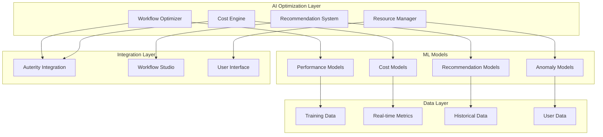

# Advanced AI Features: Sophisticated Optimization Algorithms
## Comprehensive Implementation Plan for Workflow Studio

### 🎯 **Executive Summary**

This plan outlines the implementation of sophisticated AI optimization algorithms for the Auterity Workflow Studio, leveraging machine learning models, intelligent automation, and adaptive optimization strategies to enhance workflow performance, reduce costs, and improve user experience.

---

## 📋 **Table of Contents**

1. [Core AI Optimization Algorithms](#core-algorithms)
2. [Implementation Architecture](#architecture)
3. [Feature Categories](#features)
4. [Technical Specifications](#specifications)
5. [Development Phases](#phases)
6. [Integration Strategy](#integration)
7. [Performance Metrics](#metrics)
8. [Testing & Validation](#testing)
9. [Deployment Strategy](#deployment)
10. [Monitoring & Maintenance](#monitoring)

---

## 🧠 **Core AI Optimization Algorithms** {#core-algorithms}

### 1. **Workflow Performance Optimization Engine**

#### **Smart Node Execution Ordering**
```typescript
interface WorkflowOptimizer {
  // Critical path analysis for optimal execution order
  analyzeCriticalPath(workflow: Workflow): Promise<ExecutionPlan>;
  
  // Parallel execution optimization
  optimizeParallelExecution(nodes: Node[]): Promise<ParallelExecutionPlan>;
  
  // Resource allocation optimization
  optimizeResourceAllocation(workflow: Workflow): Promise<ResourcePlan>;
  
  // Bottleneck prediction and prevention
  predictBottlenecks(workflow: Workflow): Promise<BottleneckAnalysis>;
}
```

#### **Adaptive Execution Strategies**
- **Dynamic Load Balancing**: Real-time resource redistribution
- **Intelligent Caching**: ML-driven cache optimization
- **Predictive Scaling**: Proactive resource scaling based on patterns
- **Circuit Breaker Intelligence**: Smart failure recovery patterns

### 2. **Cost Optimization AI Engine**

#### **Multi-Objective Optimization**
```typescript
interface CostOptimizationEngine {
  // Multi-criteria decision making for model selection
  optimizeModelSelection(
    requirements: PerformanceRequirements,
    constraints: BudgetConstraints
  ): Promise<ModelRecommendation>;
  
  // Dynamic pricing optimization
  optimizePricing(usage: UsagePattern): Promise<PricingStrategy>;
  
  // Budget allocation optimization
  optimizeBudgetAllocation(projects: Project[]): Promise<BudgetPlan>;
  
  // ROI maximization
  maximizeROI(investments: Investment[]): Promise<OptimizationPlan>;
}
```

### 3. **Intelligent Workflow Recommendation System**

#### **Machine Learning-Driven Suggestions**
```typescript
interface WorkflowRecommendationEngine {
  // Pattern recognition for workflow optimization
  analyzeWorkflowPatterns(workflows: Workflow[]): Promise<PatternAnalysis>;
  
  // Collaborative filtering for workflow suggestions
  generateWorkflowSuggestions(user: User): Promise<WorkflowSuggestion[]>;
  
  // Anomaly detection for workflow issues
  detectWorkflowAnomalies(workflow: Workflow): Promise<AnomalyReport>;
  
  // Predictive maintenance for workflows
  predictMaintenanceNeeds(workflow: Workflow): Promise<MaintenancePlan>;
}
```

### 4. **Adaptive Resource Management**

#### **Self-Optimizing Resource Allocation**
```typescript
interface AdaptiveResourceManager {
  // Machine learning for resource prediction
  predictResourceNeeds(workflow: Workflow): Promise<ResourcePrediction>;
  
  // Dynamic scaling algorithms
  optimizeScaling(metrics: PerformanceMetrics): Promise<ScalingDecision>;
  
  // Intelligent resource recycling
  optimizeResourceRecycling(resources: Resource[]): Promise<RecyclingPlan>;
  
  // Cost-performance optimization
  balanceCostPerformance(constraints: Constraints): Promise<OptimalBalance>;
}
```

---

## 🏗️ **Implementation Architecture** {#architecture}

### **System Architecture Overview**



### **Core Components**

#### **1. AI Optimization Service Layer**
```typescript
// Core service for all AI optimization features
export class AIOptimizationService {
  private workflowOptimizer: WorkflowOptimizer;
  private costEngine: CostOptimizationEngine;
  private recommendationSystem: WorkflowRecommendationEngine;
  private resourceManager: AdaptiveResourceManager;
  private mlModelManager: MLModelManager;
  
  constructor(config: AIOptimizationConfig) {
    this.initializeComponents(config);
    this.setupModelPipeline();
    this.configureOptimizationStrategies();
  }
}
```

#### **2. Machine Learning Model Manager**
```typescript
interface MLModelManager {
  // Model lifecycle management
  trainModel(modelType: ModelType, data: TrainingData): Promise<Model>;
  deployModel(model: Model): Promise<DeploymentResult>;
  updateModel(model: Model, newData: Data): Promise<UpdateResult>;
  retireModel(modelId: string): Promise<RetirementResult>;
  
  // Model performance monitoring
  monitorModelPerformance(modelId: string): Promise<PerformanceReport>;
  validateModelAccuracy(model: Model): Promise<ValidationResult>;
  
  // A/B testing for models
  runModelABTest(modelA: Model, modelB: Model): Promise<ABTestResult>;
}
```

#### **3. Real-time Optimization Engine**
```typescript
interface RealTimeOptimizer {
  // Continuous optimization
  optimizeContinuously(workflow: Workflow): AsyncGenerator<OptimizationUpdate>;
  
  // Event-driven optimization
  handleOptimizationTrigger(event: OptimizationEvent): Promise<OptimizationAction>;
  
  // Adaptive learning
  learnFromExecution(execution: WorkflowExecution): Promise<LearningUpdate>;
}
```

---

## 🎯 **Feature Categories** {#features}

### **1. Intelligent Workflow Optimization**

#### **Performance Features**
- **Smart Execution Planning**: AI-driven execution order optimization
- **Parallel Processing Intelligence**: Optimal parallelization strategies
- **Resource Optimization**: Dynamic resource allocation and management
- **Caching Intelligence**: ML-driven caching strategies
- **Bottleneck Prevention**: Predictive bottleneck identification and mitigation

#### **Cost Features**
- **Model Selection Optimization**: AI-driven model recommendation
- **Budget Management**: Intelligent budget allocation and monitoring
- **Cost Prediction**: ML-based cost forecasting
- **ROI Optimization**: Return on investment maximization
- **Dynamic Pricing**: Adaptive pricing strategies

### **2. Advanced Analytics & Insights**

#### **Predictive Analytics**
- **Performance Prediction**: Forecast workflow performance
- **Failure Prediction**: Predict and prevent workflow failures
- **Resource Demand Forecasting**: Predict future resource needs
- **Cost Trend Analysis**: Analyze and predict cost trends
- **User Behavior Prediction**: Predict user workflow patterns

#### **Optimization Recommendations**
- **Workflow Improvement Suggestions**: AI-generated optimization suggestions
- **Resource Optimization Recommendations**: Smart resource usage recommendations
- **Cost Reduction Strategies**: Intelligent cost-saving recommendations
- **Performance Enhancement Tips**: ML-driven performance improvement suggestions

### **3. Self-Learning & Adaptation**

#### **Continuous Learning**
- **Pattern Recognition**: Learn from workflow execution patterns
- **Anomaly Detection**: Identify and learn from unusual patterns
- **Adaptive Optimization**: Continuously improve optimization strategies
- **Feedback Integration**: Learn from user feedback and preferences

#### **Automated Optimization**
- **Self-Healing Workflows**: Automatic error recovery and optimization
- **Dynamic Reconfiguration**: Automatic workflow reconfiguration
- **Proactive Optimization**: Anticipate and prevent performance issues
- **Intelligent Scaling**: Automatic resource scaling based on predictions

---

## 🔧 **Technical Specifications** {#specifications}

### **Machine Learning Models**

#### **1. Workflow Performance Prediction Model**
```typescript
interface PerformancePredictionModel {
  modelType: 'gradient_boosting' | 'neural_network' | 'ensemble';
  features: {
    workflowComplexity: number;
    nodeCount: number;
    dataVolumeGB: number;
    historicalExecutionTime: number;
    resourceUtilization: ResourceMetrics;
    userProfile: UserCharacteristics;
  };
  target: {
    expectedExecutionTime: number;
    expectedResourceUsage: ResourceUsage;
    expectedCost: number;
    probabilityOfSuccess: number;
  };
}
```

#### **2. Cost Optimization Model**
```typescript
interface CostOptimizationModel {
  modelType: 'linear_regression' | 'decision_tree' | 'reinforcement_learning';
  features: {
    modelType: string;
    inputTokens: number;
    outputTokens: number;
    complexity: number;
    timeOfDay: number;
    userTier: string;
    historicalCosts: number[];
  };
  target: {
    optimalModel: string;
    estimatedCost: number;
    costSavings: number;
    performanceImpact: number;
  };
}
```

#### **3. Anomaly Detection Model**
```typescript
interface AnomalyDetectionModel {
  modelType: 'isolation_forest' | 'autoencoder' | 'statistical';
  features: {
    executionMetrics: ExecutionMetrics;
    resourceUsage: ResourceUsage;
    errorRates: ErrorMetrics;
    performanceMetrics: PerformanceMetrics;
    userBehavior: BehaviorMetrics;
  };
  target: {
    anomalyScore: number;
    anomalyType: AnomalyType;
    severity: 'low' | 'medium' | 'high' | 'critical';
    recommendedAction: string;
  };
}
```

### **Optimization Algorithms**

#### **1. Multi-Objective Optimization**
```typescript
class MultiObjectiveOptimizer {
  // Pareto-optimal solutions for competing objectives
  async findParetoOptimalSolutions(
    objectives: Objective[],
    constraints: Constraint[]
  ): Promise<ParetoSolution[]> {
    // Implementation using genetic algorithms or other MOO techniques
  }
  
  // Weighted optimization for user preferences
  async optimizeWithWeights(
    objectives: WeightedObjective[],
    constraints: Constraint[]
  ): Promise<OptimalSolution> {
    // Implementation using weighted sum or goal programming
  }
}
```

#### **2. Reinforcement Learning Optimization**
```typescript
class ReinforcementLearningOptimizer {
  // Q-learning for workflow optimization
  async trainQAgent(
    environment: WorkflowEnvironment,
    episodes: number
  ): Promise<QAgent> {
    // Implementation of Q-learning algorithm
  }
  
  // Policy gradient for continuous optimization
  async trainPolicyGradient(
    environment: WorkflowEnvironment,
    episodes: number
  ): Promise<PolicyAgent> {
    // Implementation of policy gradient methods
  }
}
```

### **Data Pipeline Architecture**

#### **Real-time Data Processing**
```typescript
interface DataPipeline {
  // Stream processing for real-time optimization
  processRealTimeData(stream: DataStream): AsyncGenerator<ProcessedData>;
  
  // Batch processing for model training
  processBatchData(batch: DataBatch): Promise<ProcessedBatch>;
  
  // Feature engineering pipeline
  engineerFeatures(rawData: RawData): Promise<EngineereedFeatures>;
  
  // Data validation and quality checks
  validateData(data: Data): Promise<ValidationResult>;
}
```

---

## 📅 **Development Phases** {#phases}

### **Phase 1: Foundation & Core Infrastructure (Weeks 1-2)**

#### **Week 1: Core Architecture Setup**
- [ ] **AI Optimization Service Foundation**
  - Create base `AIOptimizationService` class
  - Implement configuration management
  - Set up dependency injection framework
  - Create interface definitions

- [ ] **ML Model Infrastructure**
  - Set up model training pipeline
  - Implement model versioning system
  - Create model deployment infrastructure
  - Set up model monitoring framework

- [ ] **Data Pipeline Setup**
  - Implement real-time data collection
  - Set up data preprocessing pipeline
  - Create feature engineering framework
  - Implement data validation system

#### **Week 2: Basic Optimization Algorithms**
- [ ] **Workflow Performance Optimizer**
  - Implement basic execution planning
  - Create resource allocation algorithms
  - Set up performance monitoring
  - Implement basic bottleneck detection

- [ ] **Cost Optimization Engine**
  - Create basic cost prediction model
  - Implement model selection algorithms
  - Set up budget monitoring
  - Create cost analytics dashboard

### **Phase 2: Advanced AI Features (Weeks 3-4)**

#### **Week 3: Machine Learning Models**
- [ ] **Performance Prediction Models**
  - Train execution time prediction model
  - Implement resource usage prediction
  - Create performance regression detection
  - Set up model validation framework

- [ ] **Cost Optimization Models**
  - Train cost prediction models
  - Implement dynamic pricing algorithms
  - Create budget optimization models
  - Set up ROI optimization

#### **Week 4: Intelligent Recommendations**
- [ ] **Workflow Recommendation Engine**
  - Implement pattern recognition algorithms
  - Create collaborative filtering system
  - Set up anomaly detection models
  - Implement recommendation scoring

- [ ] **Adaptive Resource Management**
  - Create resource prediction models
  - Implement dynamic scaling algorithms
  - Set up intelligent caching
  - Create resource optimization engine

### **Phase 3: Advanced Optimization & Self-Learning (Weeks 5-6)**

#### **Week 5: Multi-Objective Optimization**
- [ ] **Pareto Optimization**
  - Implement multi-objective algorithms
  - Create preference learning system
  - Set up solution ranking
  - Implement trade-off analysis

- [ ] **Reinforcement Learning**
  - Implement Q-learning optimization
  - Create policy gradient methods
  - Set up continuous learning
  - Implement exploration strategies

#### **Week 6: Self-Learning Systems**
- [ ] **Continuous Learning Pipeline**
  - Implement online learning algorithms
  - Create feedback integration system
  - Set up model adaptation
  - Implement incremental training

- [ ] **Automated Optimization**
  - Create self-healing workflows
  - Implement proactive optimization
  - Set up automatic reconfiguration
  - Create intelligent automation

### **Phase 4: Integration & Production (Weeks 7-8)**

#### **Week 7: UI Integration**
- [ ] **Advanced AI Panel**
  - Create AI optimization dashboard
  - Implement recommendation interface
  - Set up performance visualization
  - Create optimization controls

- [ ] **Real-time Monitoring**
  - Implement live optimization tracking
  - Create performance dashboards
  - Set up alert systems
  - Implement trend analysis

#### **Week 8: Production Deployment**
- [ ] **Production Infrastructure**
  - Set up production ML pipelines
  - Implement monitoring and alerting
  - Create backup and recovery
  - Set up performance optimization

- [ ] **Documentation & Training**
  - Create user documentation
  - Implement in-app guidance
  - Set up training materials
  - Create best practices guide

---

## 🔗 **Integration Strategy** {#integration}

### **Seamless Auterity Integration**

#### **1. Enhanced AuterityIntegrationService**
```typescript
export class EnhancedAuterityIntegrationService extends AuterityIntegrationService {
  private aiOptimizationService: AIOptimizationService;
  private mlModelManager: MLModelManager;
  private realTimeOptimizer: RealTimeOptimizer;
  
  async executeWorkflowWithAIOptimization(
    workflow: Workflow,
    inputs: Record<string, any> = {}
  ): Promise<OptimizedExecutionResult> {
    // AI-optimized workflow execution with real-time optimization
    const optimizationPlan = await this.aiOptimizationService.optimizeWorkflow(workflow);
    const optimizedWorkflow = await this.applyOptimizations(workflow, optimizationPlan);
    
    return await this.executeOptimizedWorkflow(optimizedWorkflow, inputs);
  }
  
  async getAdvancedAISuggestions(
    workflow: Workflow
  ): Promise<AdvancedAISuggestion[]> {
    // Multi-model AI suggestions with confidence scoring
    const suggestions = await Promise.all([
      this.getPerformanceOptimizations(workflow),
      this.getCostOptimizations(workflow),
      this.getQualityImprovements(workflow),
      this.getSecurityEnhancements(workflow)
    ]);
    
    return this.rankAndFilterSuggestions(suggestions.flat());
  }
}
```

#### **2. AI-Enhanced UI Components**
```typescript
export const AIOptimizationPanel: React.FC = () => {
  const { state, actions } = useStudioStore();
  const { aiOptimizations, realTimeMetrics } = useAIOptimization();
  
  return (
    <div className="ai-optimization-panel">
      <OptimizationDashboard metrics={realTimeMetrics} />
      <RecommendationsList suggestions={aiOptimizations.suggestions} />
      <PerformancePredictions predictions={aiOptimizations.predictions} />
      <CostOptimizationControls onOptimize={actions.optimizeWorkflow} />
      <RealTimeMonitoring workflow={state.currentWorkflow} />
    </div>
  );
};
```

### **Data Flow Integration**

#### **Real-time Optimization Pipeline**
```typescript
interface OptimizationPipeline {
  // Continuous data collection
  collectExecutionData(execution: WorkflowExecution): void;
  
  // Real-time feature engineering
  engineerFeatures(data: ExecutionData): Features;
  
  // Model inference
  runInference(features: Features): Predictions;
  
  // Optimization decision making
  makeOptimizationDecisions(predictions: Predictions): OptimizationActions;
  
  // Action execution
  executeOptimizations(actions: OptimizationActions): Promise<Results>;
}
```

---

## 📊 **Performance Metrics** {#metrics}

### **Optimization Effectiveness Metrics**

#### **Performance Improvements**
- **Execution Time Reduction**: Target 25-40% improvement
- **Resource Efficiency**: Target 30-50% better resource utilization
- **Throughput Increase**: Target 20-35% higher workflow throughput
- **Error Rate Reduction**: Target 40-60% fewer execution errors

#### **Cost Optimization Metrics**
- **Cost Reduction**: Target 25-45% cost savings
- **Budget Adherence**: Target 95%+ budget compliance
- **ROI Improvement**: Target 30-50% better ROI
- **Resource Waste Reduction**: Target 35-55% less waste

#### **AI Model Performance**
- **Prediction Accuracy**: Target 90%+ accuracy for cost/performance predictions
- **Recommendation Relevance**: Target 85%+ user acceptance rate
- **Model Latency**: Target <100ms for real-time optimizations
- **Learning Efficiency**: Target continuous improvement in model performance

### **User Experience Metrics**

#### **Usability Improvements**
- **Time to Optimization**: Target <30 seconds for optimization suggestions
- **User Adoption Rate**: Target 80%+ adoption of AI recommendations
- **User Satisfaction**: Target 4.5+ star rating for AI features
- **Learning Curve**: Target <1 hour to understand AI features

#### **System Reliability**
- **Uptime**: Target 99.9% availability for AI services
- **Response Time**: Target <200ms for AI-powered features
- **Error Recovery**: Target <5 minutes for automatic recovery
- **Data Consistency**: Target 100% data integrity

---

## 🧪 **Testing & Validation** {#testing}

### **AI Model Testing Strategy**

#### **1. Model Validation Framework**
```typescript
interface ModelValidationSuite {
  // Cross-validation testing
  crossValidate(model: Model, folds: number): Promise<ValidationResults>;
  
  // A/B testing framework
  runABTest(modelA: Model, modelB: Model): Promise<ABTestResults>;
  
  // Performance regression testing
  testPerformanceRegression(model: Model): Promise<RegressionResults>;
  
  // Bias detection and fairness testing
  testModelFairness(model: Model): Promise<FairnessResults>;
}
```

#### **2. Optimization Algorithm Testing**
```typescript
interface OptimizationTesting {
  // Algorithm effectiveness testing
  testOptimizationEffectiveness(
    algorithm: OptimizationAlgorithm,
    testCases: TestCase[]
  ): Promise<EffectivenessResults>;
  
  // Convergence testing
  testConvergence(algorithm: OptimizationAlgorithm): Promise<ConvergenceResults>;
  
  // Robustness testing
  testRobustness(algorithm: OptimizationAlgorithm): Promise<RobustnessResults>;
}
```

### **Integration Testing**

#### **End-to-End Testing**
- **Workflow Optimization E2E**: Test complete optimization pipeline
- **Real-time Performance Testing**: Test real-time optimization features
- **Cost Optimization Integration**: Test cost optimization with actual workflows
- **User Experience Testing**: Test AI feature usability and effectiveness

#### **Load Testing**
- **High-Volume Workflow Testing**: Test with 1000+ concurrent workflows
- **ML Model Performance Testing**: Test model performance under load
- **Real-time Optimization Scalability**: Test real-time features at scale
- **Cost Optimization at Scale**: Test cost optimization with high usage

---

## 🚀 **Deployment Strategy** {#deployment}

### **Phased Rollout Plan**

#### **Phase 1: Internal Testing (Week 9)**
- Deploy to development environment
- Internal team testing and validation
- Performance benchmarking
- Bug fixes and refinements

#### **Phase 2: Beta Release (Week 10)**
- Limited beta user group (50 users)
- Feature feedback collection
- Performance monitoring
- Optimization based on feedback

#### **Phase 3: Gradual Rollout (Weeks 11-12)**
- 25% user rollout
- Monitor performance metrics
- A/B test new features
- Scale infrastructure as needed

#### **Phase 4: Full Production (Week 13+)**
- 100% user rollout
- Full feature availability
- Continuous monitoring
- Ongoing optimization

### **Infrastructure Requirements**

#### **ML Infrastructure**
```yaml
# Production ML Infrastructure
ml_infrastructure:
  model_serving:
    replicas: 3
    cpu: "2000m"
    memory: "4Gi"
    gpu: "1"
    
  training_pipeline:
    cpu: "4000m"
    memory: "8Gi"
    storage: "100Gi"
    
  feature_store:
    replicas: 2
    cpu: "1000m"
    memory: "2Gi"
    storage: "50Gi"
    
  monitoring:
    prometheus: true
    grafana: true
    mlflow: true
```

#### **Real-time Processing**
```yaml
# Real-time Optimization Infrastructure
realtime_processing:
  stream_processing:
    kafka_streams: 3
    processing_cores: 8
    memory: "16Gi"
    
  optimization_engine:
    replicas: 5
    cpu: "2000m"
    memory: "4Gi"
    
  cache_layer:
    redis_cluster: 3
    memory: "8Gi"
```

---

## 📈 **Monitoring & Maintenance** {#monitoring}

### **AI Model Monitoring**

#### **Performance Monitoring**
```typescript
interface AIModelMonitoring {
  // Model performance tracking
  trackModelPerformance(modelId: string): Promise<PerformanceMetrics>;
  
  // Drift detection
  detectDataDrift(model: Model, newData: Data): Promise<DriftReport>;
  
  // Model degradation detection
  detectModelDegradation(model: Model): Promise<DegradationReport>;
  
  // Automated retraining triggers
  checkRetrainingTriggers(model: Model): Promise<RetrainingDecision>;
}
```

#### **Business Impact Monitoring**
- **Cost Savings Tracking**: Monitor actual vs. predicted cost savings
- **Performance Improvement Tracking**: Monitor workflow performance improvements
- **User Satisfaction Monitoring**: Track user satisfaction with AI features
- **ROI Measurement**: Measure return on investment for AI features

### **Continuous Improvement**

#### **Feedback Loops**
- **User Feedback Integration**: Continuously improve based on user feedback
- **Performance Feedback**: Learn from actual workflow performance
- **Cost Feedback**: Improve cost predictions based on actual costs
- **Error Feedback**: Learn from errors and failures

#### **Model Evolution**
- **Automated Model Updates**: Regularly update models with new data
- **A/B Testing for Improvements**: Test model improvements before deployment
- **Feature Engineering Evolution**: Continuously improve feature engineering
- **Algorithm Optimization**: Optimize algorithms based on performance data

---

## 🎯 **Success Criteria & KPIs**

### **Technical Success Metrics**
- **Model Accuracy**: >90% for cost/performance predictions
- **Response Time**: <100ms for real-time optimizations
- **System Uptime**: >99.9% availability
- **Error Rate**: <1% system error rate

### **Business Success Metrics**
- **Cost Reduction**: 25-45% reduction in workflow execution costs
- **Performance Improvement**: 25-40% improvement in execution time
- **User Adoption**: 80%+ adoption rate for AI features
- **ROI**: 200%+ return on investment within 6 months

### **User Experience Metrics**
- **User Satisfaction**: 4.5+ star rating
- **Feature Usage**: 70%+ regular usage of AI features
- **Time to Value**: <30 minutes to see first optimization benefits
- **Support Tickets**: <5% increase in support volume

---

## 📚 **Documentation & Training**

### **Technical Documentation**
- **API Documentation**: Comprehensive API reference
- **Architecture Guide**: System architecture and design patterns
- **Integration Guide**: Step-by-step integration instructions
- **Troubleshooting Guide**: Common issues and solutions

### **User Documentation**
- **User Guide**: Complete user manual for AI features
- **Quick Start Guide**: Getting started with AI optimization
- **Best Practices**: Optimization best practices and tips
- **FAQ**: Frequently asked questions and answers

### **Training Materials**
- **Video Tutorials**: Step-by-step video guides
- **Interactive Tutorials**: In-app guided tutorials
- **Webinar Series**: Regular training webinars
- **Certification Program**: AI optimization certification

---

## 🔮 **Future Enhancements**

### **Advanced AI Capabilities**
- **Natural Language Optimization**: Optimize workflows using natural language commands
- **Computer Vision Integration**: Visual workflow optimization and analysis
- **Advanced Reinforcement Learning**: More sophisticated RL algorithms
- **Federated Learning**: Collaborative learning across organizations

### **Integration Expansions**
- **Third-party Tool Integration**: Integration with popular development tools
- **Cloud Provider Optimization**: Multi-cloud optimization strategies
- **Edge Computing**: Edge-based optimization for low-latency requirements
- **IoT Integration**: Optimization for IoT workflow scenarios

### **Enterprise Features**
- **Multi-tenant Optimization**: Organization-wide optimization strategies
- **Compliance Automation**: Automated compliance checking and optimization
- **Advanced Security**: AI-powered security optimization
- **Audit Trail Enhancement**: Detailed audit trails for all optimizations

---

This comprehensive plan provides a roadmap for implementing sophisticated AI optimization algorithms in the Workflow Studio, creating a cutting-edge platform that learns, adapts, and continuously improves to deliver optimal performance and cost efficiency.
