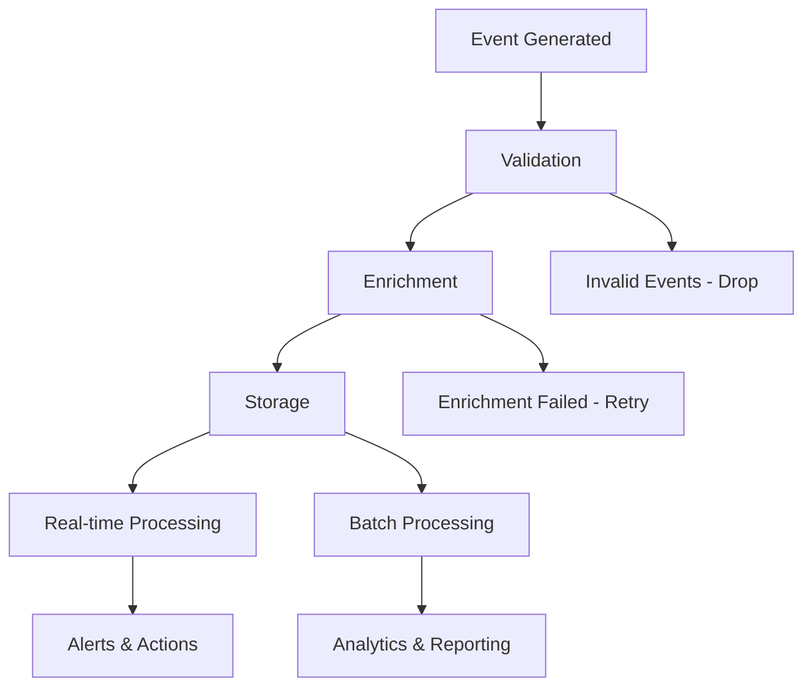

# Analytics Events Catalog

## Overview

This catalog documents all analytics events tracked across the Auterity platform. Events are categorized by functional area and include detailed specifications for event structure, triggers, and business usage.

## 📊 Event Categories

### User Engagement Events
Events related to user interactions and platform usage.

### Workflow Events
Events related to workflow creation, execution, and management.

### AI Processing Events
Events related to AI model usage and performance.

### Integration Events
Events related to third-party system integrations.

### System Events
Events related to platform performance and health.

### Business Events
Events related to business outcomes and ROI tracking.

---

## 👤 User Engagement Events

### User Authentication Events

#### `user.login`

**Description:** User successfully logs into the platform.

**Trigger:** Successful authentication via any method (username/password, SSO, MFA).

**Properties:**
```typescript
{
  user_id: string,           // User identifier
  organization_id: string,   // Organization identifier
  login_method: string,      // 'password', 'sso', 'mfa'
  device_type: string,       // 'desktop', 'mobile', 'tablet'
  browser: string,          // Browser name and version
  ip_address: string,        // Client IP (anonymized)
  session_id: string,        // Session identifier
  login_timestamp: Date      // Login timestamp
}
```

**Usage:**
- Track user activity patterns
- Monitor authentication success rates
- Identify peak usage times
- Detect unusual login patterns

#### `user.logout`

**Description:** User logs out of the platform.

**Trigger:** Explicit logout or session expiration.

**Properties:**
```typescript
{
  user_id: string,
  organization_id: string,
  session_id: string,
  session_duration: number,    // Minutes
  logout_reason: string,       // 'manual', 'timeout', 'forced'
  logout_timestamp: Date
}
```

**Usage:**
- Calculate session duration statistics
- Monitor user engagement patterns
- Track session timeout frequencies

#### `user.session_expired`

**Description:** User session expires due to inactivity.

**Trigger:** Session timeout after period of inactivity.

**Properties:**
```typescript
{
  user_id: string,
  organization_id: string,
  session_id: string,
  last_activity: Date,         // Last user action
  session_duration: number,    // Total session time in minutes
  expiry_timestamp: Date
}
```

**Usage:**
- Optimize session timeout settings
- Monitor user activity patterns
- Improve user experience design

### User Interaction Events

#### `user.page_view`

**Description:** User views a page or screen in the application.

**Trigger:** Page load or route change.

**Properties:**
```typescript
{
  user_id: string,
  organization_id: string,
  page_path: string,           // '/workflows', '/analytics'
  page_title: string,          // Human-readable page name
  referrer: string,            // Previous page path
  time_on_page: number,        // Seconds spent on page
  viewport_size: string,       // 'desktop', 'tablet', 'mobile'
  timestamp: Date
}
```

**Usage:**
- Track user navigation patterns
- Identify popular features
- Optimize user experience
- Monitor feature adoption

#### `user.feature_used`

**Description:** User interacts with a specific feature or tool.

**Trigger:** Feature activation or usage.

**Properties:**
```typescript
{
  user_id: string,
  organization_id: string,
  feature_name: string,        // 'workflow_builder', 'ai_assistant'
  feature_category: string,    // 'creation', 'analysis', 'collaboration'
  action_type: string,         // 'create', 'edit', 'delete', 'execute'
  context: object,             // Feature-specific context
  duration: number,            // Interaction duration in seconds
  timestamp: Date
}
```

**Usage:**
- Measure feature adoption rates
- Identify popular functionality
- Track user proficiency
- Guide product development

#### `user.search_performed`

**Description:** User performs a search within the platform.

**Trigger:** Search query execution.

**Properties:**
```typescript
{
  user_id: string,
  organization_id: string,
  search_query: string,        // The search term(s)
  search_category: string,     // 'workflows', 'templates', 'users'
  results_count: number,       // Number of results returned
  search_filters: object,      // Applied filters
  search_duration: number,     // Search execution time in ms
  clicked_result: string,      // First result clicked (if any)
  timestamp: Date
}
```

**Usage:**
- Optimize search functionality
- Understand user intent
- Improve content discoverability
- Track information-seeking patterns

---

## 🔄 Workflow Events

### Workflow Creation Events

#### `workflow.created`

**Description:** New workflow is created.

**Trigger:** Workflow save after creation.

**Properties:**
```typescript
{
  workflow_id: string,
  organization_id: string,
  created_by: string,          // User ID
  workflow_name: string,
  category: string,            // 'service', 'sales', 'parts'
  node_count: number,          // Number of nodes
  template_used: boolean,      // Whether created from template
  template_id: string,         // Template ID if applicable
  complexity_score: number,    // 1-10 scale
  estimated_duration: number,  // Expected execution time in seconds
  timestamp: Date
}
```

**Usage:**
- Track workflow creation patterns
- Measure template utilization
- Monitor platform adoption
- Identify training needs

#### `workflow.updated`

**Description:** Existing workflow is modified.

**Trigger:** Workflow save after modification.

**Properties:**
```typescript
{
  workflow_id: string,
  organization_id: string,
  updated_by: string,
  changes_made: string[],      // 'nodes_added', 'nodes_removed', 'config_changed'
  previous_version: number,
  new_version: number,
  time_since_last_edit: number, // Hours
  edit_duration: number,       // Minutes spent editing
  timestamp: Date
}
```

**Usage:**
- Track workflow evolution
- Monitor collaborative editing
- Identify frequently modified workflows
- Measure user engagement

#### `workflow.deleted`

**Description:** Workflow is deleted.

**Trigger:** Workflow deletion action.

**Properties:**
```typescript
{
  workflow_id: string,
  organization_id: string,
  deleted_by: string,
  workflow_name: string,
  category: string,
  age_days: number,            // Days since creation
  execution_count: number,     // Total executions before deletion
  last_execution: Date,        // Last execution date
  deletion_reason: string,     // User-provided reason
  timestamp: Date
}
```

**Usage:**
- Track workflow lifecycle
- Identify usage patterns
- Monitor cleanup activities
- Prevent accidental deletions

### Workflow Execution Events

#### `workflow.execution_started`

**Description:** Workflow execution begins.

**Trigger:** Workflow execution initiation.

**Properties:**
```typescript
{
  execution_id: string,
  workflow_id: string,
  organization_id: string,
  triggered_by: string,        // User ID or 'system'
  trigger_type: string,        // 'manual', 'schedule', 'webhook', 'api'
  input_data_size: number,     // Size of input data in bytes
  estimated_duration: number,  // Expected execution time
  priority_level: string,      // 'low', 'medium', 'high', 'critical'
  execution_environment: string, // 'production', 'staging', 'test'
  timestamp: Date
}
```

**Usage:**
- Monitor execution patterns
- Track system load
- Measure user activity
- Optimize resource allocation

#### `workflow.execution_completed`

**Description:** Workflow execution finishes successfully.

**Trigger:** Successful workflow completion.

**Properties:**
```typescript
{
  execution_id: string,
  workflow_id: string,
  organization_id: string,
  actual_duration: number,     // Actual execution time in seconds
  nodes_executed: number,      // Number of nodes processed
  data_processed: number,      // Amount of data processed in bytes
  cost_incurred: number,       // Total execution cost in USD
  output_data_size: number,    // Size of output data in bytes
  timestamp: Date
}
```

**Usage:**
- Measure performance metrics
- Track cost patterns
- Monitor system efficiency
- Identify optimization opportunities

#### `workflow.execution_failed`

**Description:** Workflow execution fails.

**Trigger:** Workflow execution error or timeout.

**Properties:**
```typescript
{
  execution_id: string,
  workflow_id: string,
  organization_id: string,
  failure_reason: string,      // 'timeout', 'node_error', 'system_error'
  failed_node_id: string,      // ID of node that failed
  failed_node_type: string,    // Type of failed node
  error_message: string,       // Error description (sanitized)
  execution_duration: number,  // Time before failure
  retry_attempt: number,       // Retry attempt number
  timestamp: Date
}
```

**Usage:**
- Monitor system reliability
- Identify common failure patterns
- Track error resolution times
- Guide platform improvements

#### `workflow.node_executed`

**Description:** Individual workflow node completes execution.

**Trigger:** Node execution completion.

**Properties:**
```typescript
{
  execution_id: string,
  workflow_id: string,
  node_id: string,
  node_type: string,           // 'ai_processing', 'data_transform', 'email_sender'
  execution_duration: number,  // Node execution time in milliseconds
  data_input_size: number,     // Input data size in bytes
  data_output_size: number,    // Output data size in bytes
  success: boolean,           // Whether node executed successfully
  error_message: string,      // Error details if failed (sanitized)
  timestamp: Date
}
```

**Usage:**
- Identify performance bottlenecks
- Monitor node reliability
- Track data processing patterns
- Optimize workflow design

---

## 🤖 AI Processing Events

### AI Model Usage Events

#### `ai.model_requested`

**Description:** AI model processing is requested.

**Trigger:** AI node execution starts.

**Properties:**
```typescript
{
  request_id: string,
  workflow_id: string,
  execution_id: string,
  organization_id: string,
  model_provider: string,      // 'openai', 'anthropic', 'azure'
  model_name: string,          // 'gpt-4', 'claude-3', 'gpt-3.5-turbo'
  task_type: string,           // 'text_generation', 'analysis', 'classification'
  input_tokens: number,        // Number of input tokens
  estimated_cost: number,      // Estimated cost in USD
  priority_level: string,      // 'low', 'medium', 'high'
  timestamp: Date
}
```

**Usage:**
- Track AI usage patterns
- Monitor cost distribution
- Measure model performance
- Optimize resource allocation

#### `ai.model_completed`

**Description:** AI model processing completes successfully.

**Trigger:** AI processing finishes successfully.

**Properties:**
```typescript
{
  request_id: string,
  workflow_id: string,
  execution_id: string,
  organization_id: string,
  model_provider: string,
  model_name: string,
  actual_cost: number,         // Actual cost in USD
  input_tokens: number,
  output_tokens: number,
  processing_time: number,     // Processing time in milliseconds
  response_quality: number,    // 1-10 quality score (if available)
  timestamp: Date
}
```

**Usage:**
- Calculate cost per transaction
- Measure processing efficiency
- Track model performance
- Monitor quality metrics

#### `ai.model_failed`

**Description:** AI model processing fails.

**Trigger:** AI processing error or timeout.

**Properties:**
```typescript
{
  request_id: string,
  workflow_id: string,
  execution_id: string,
  organization_id: string,
  model_provider: string,
  model_name: string,
  failure_reason: string,      // 'timeout', 'rate_limit', 'api_error', 'invalid_input'
  error_code: string,          // Provider-specific error code
  retry_attempt: number,       // Number of retry attempts
  processing_time: number,     // Time before failure
  timestamp: Date
}
```

**Usage:**
- Monitor AI reliability
- Track failure patterns
- Optimize retry strategies
- Identify model limitations

### AI Cost Events

#### `ai.cost_incurred`

**Description:** AI processing cost is incurred.

**Trigger:** Successful AI processing completion.

**Properties:**
```typescript
{
  organization_id: string,
  model_provider: string,
  model_name: string,
  cost_amount: number,          // Cost in USD
  tokens_used: number,          // Total tokens consumed
  cost_per_token: number,       // Cost per token
  billing_period: string,       // Monthly billing period
  workflow_category: string,    // 'service', 'sales', 'parts'
  timestamp: Date
}
```

**Usage:**
- Track spending patterns
- Monitor budget utilization
- Calculate ROI metrics
- Optimize cost allocation

---

## 🔗 Integration Events

### Data Synchronization Events

#### `integration.sync_started`

**Description:** Integration synchronization begins.

**Trigger:** Scheduled sync or manual trigger.

**Properties:**
```typescript
{
  integration_id: string,
  organization_id: string,
  integration_type: string,    // 'dms', 'crm', 'communication'
  provider: string,           // 'cdk_global', 'salesforce', 'twilio'
  sync_type: string,          // 'full', 'incremental', 'manual'
  estimated_records: number,  // Expected number of records
  trigger_type: string,       // 'schedule', 'manual', 'webhook'
  timestamp: Date
}
```

**Usage:**
- Monitor integration health
- Track data flow patterns
- Measure sync performance
- Identify integration issues

#### `integration.sync_completed`

**Description:** Integration synchronization completes successfully.

**Trigger:** Successful sync completion.

**Properties:**
```typescript
{
  integration_id: string,
  organization_id: string,
  integration_type: string,
  provider: string,
  records_processed: number,   // Actual records processed
  records_created: number,     // New records created
  records_updated: number,     // Existing records updated
  records_failed: number,      // Records that failed to sync
  sync_duration: number,       // Sync duration in seconds
  data_volume: number,         // Data transferred in bytes
  timestamp: Date
}
```

**Usage:**
- Measure sync efficiency
- Track data volume trends
- Monitor success rates
- Identify performance bottlenecks

#### `integration.sync_failed`

**Description:** Integration synchronization fails.

**Trigger:** Sync error or timeout.

**Properties:**
```typescript
{
  integration_id: string,
  organization_id: string,
  integration_type: string,
  provider: string,
  failure_reason: string,      // 'auth_error', 'timeout', 'api_error', 'data_error'
  error_message: string,       // Detailed error description
  records_processed: number,   // Records processed before failure
  sync_duration: number,       // Time before failure
  retry_attempt: number,       // Retry attempt number
  timestamp: Date
}
```

**Usage:**
- Monitor integration reliability
- Track failure patterns
- Guide troubleshooting efforts
- Measure mean time to resolution

### API Integration Events

#### `api.request_received`

**Description:** API request is received.

**Trigger:** Incoming API request.

**Properties:**
```typescript
{
  organization_id: string,
  api_key_id: string,          // API key identifier (hashed)
  endpoint: string,            // API endpoint path
  method: string,              // HTTP method
  user_agent: string,          // Client user agent
  ip_address: string,          // Client IP (anonymized)
  request_size: number,        // Request payload size in bytes
  timestamp: Date
}
```

**Usage:**
- Monitor API usage patterns
- Track endpoint popularity
- Identify client behavior
- Support capacity planning

#### `api.request_completed`

**Description:** API request completes successfully.

**Trigger:** Successful API response.

**Properties:**
```typescript
{
  organization_id: string,
  api_key_id: string,
  endpoint: string,
  method: string,
  response_status: number,     // HTTP status code
  response_size: number,       // Response payload size in bytes
  processing_time: number,     // Request processing time in milliseconds
  rate_limit_remaining: number, // Remaining requests in current window
  timestamp: Date
}
```

**Usage:**
- Measure API performance
- Track response times
- Monitor rate limit usage
- Identify slow endpoints

#### `api.request_failed`

**Description:** API request fails.

**Trigger:** API error response (4xx, 5xx).

**Properties:**
```typescript
{
  organization_id: string,
  api_key_id: string,
  endpoint: string,
  method: string,
  response_status: number,     // HTTP error status code
  error_type: string,          // 'authentication', 'authorization', 'validation', 'server_error'
  error_message: string,       // Error description (sanitized)
  processing_time: number,     // Time before failure
  retry_attempt: number,       // Retry attempt number
  timestamp: Date
}
```

**Usage:**
- Monitor API error rates
- Track failure patterns
- Guide API improvements
- Support debugging efforts

---

## 🔧 System Events

### Performance Events

#### `system.performance_metric`

**Description:** System performance metric is recorded.

**Trigger:** Regular performance monitoring.

**Properties:**
```typescript
{
  metric_name: string,         // 'cpu_usage', 'memory_usage', 'response_time'
  metric_value: number,        // Metric value
  metric_unit: string,         // 'percentage', 'bytes', 'milliseconds'
  service_name: string,        // 'api', 'frontend', 'database'
  environment: string,         // 'production', 'staging', 'development'
  threshold_breached: boolean, // Whether threshold was exceeded
  severity_level: string,      // 'low', 'medium', 'high', 'critical'
  timestamp: Date
}
```

**Usage:**
- Monitor system health
- Track performance trends
- Identify capacity issues
- Support alerting decisions

#### `system.error_occurred`

**Description:** System error is detected.

**Trigger:** Application error or exception.

**Properties:**
```typescript
{
  error_id: string,            // Unique error identifier
  error_type: string,          // 'application', 'database', 'network', 'system'
  error_severity: string,      // 'low', 'medium', 'high', 'critical'
  error_message: string,       // Error description (sanitized)
  service_name: string,
  environment: string,
  user_affected: string,       // User ID if applicable
  request_id: string,          // Associated request ID
  stack_trace: string,         // Stack trace (development only)
  timestamp: Date
}
```

**Usage:**
- Track error patterns
- Monitor system stability
- Guide troubleshooting efforts
- Measure error resolution times

### Security Events

#### `security.login_attempt`

**Description:** User login attempt is made.

**Trigger:** Authentication attempt.

**Properties:**
```typescript
{
  user_id: string,             // User identifier (if known)
  organization_id: string,
  login_method: string,        // 'password', 'sso', 'mfa'
  success: boolean,           // Whether login was successful
  failure_reason: string,     // Reason for failure if applicable
  ip_address: string,          // Client IP (anonymized)
  user_agent: string,          // Client user agent
  device_fingerprint: string,  // Device identification hash
  suspicious_activity: boolean, // Whether activity appears suspicious
  timestamp: Date
}
```

**Usage:**
- Monitor authentication patterns
- Detect security threats
- Track login success rates
- Support fraud detection

#### `security.suspicious_activity`

**Description:** Suspicious security-related activity is detected.

**Trigger:** Security monitoring rules trigger.

**Properties:**
```typescript
{
  activity_type: string,       // 'brute_force', 'unusual_location', 'anomalous_behavior'
  severity_level: string,      // 'low', 'medium', 'high', 'critical'
  user_id: string,
  organization_id: string,
  ip_address: string,
  user_agent: string,
  activity_details: object,    // Activity-specific details
  risk_score: number,          // 0-100 risk assessment
  automated_response: string,  // 'none', 'alert', 'block', 'investigate'
  timestamp: Date
}
```

**Usage:**
- Monitor security threats
- Track risk patterns
- Measure security effectiveness
- Support incident response

---

## 💼 Business Events

### Customer Success Events

#### `business.workflow_value_delivered`

**Description:** Workflow delivers measurable business value.

**Trigger:** Workflow execution that saves time or generates revenue.

**Properties:**
```typescript
{
  workflow_id: string,
  organization_id: string,
  value_type: string,          // 'time_saved', 'cost_reduction', 'revenue_generated'
  value_amount: number,        // Value amount (hours saved, dollars, etc.)
  value_unit: string,          // 'hours', 'usd', 'percentage'
  customer_impact: string,     // 'internal_efficiency', 'customer_satisfaction', 'revenue'
  calculation_method: string,  // How value was calculated
  confidence_level: string,    // 'estimated', 'measured', 'verified'
  timestamp: Date
}
```

**Usage:**
- Track ROI metrics
- Measure business impact
- Demonstrate value delivery
- Support customer success efforts

#### `business.user_adoption_milestone`

**Description:** User reaches adoption milestone.

**Trigger:** User achieves significant usage milestone.

**Properties:**
```typescript
{
  user_id: string,
  organization_id: string,
  milestone_type: string,      // 'first_workflow', 'tenth_execution', 'power_user'
  milestone_value: number,     // Milestone achievement value
  time_to_achieve: number,     // Days from account creation
  adoption_stage: string,      // 'explorer', 'early_adopter', 'regular_user', 'power_user'
  engagement_score: number,    // 0-100 engagement assessment
  timestamp: Date
}
```

**Usage:**
- Track user progression
- Measure adoption success
- Identify engagement patterns
- Guide customer success efforts

### Revenue Events

#### `business.revenue_generated`

**Description:** Revenue is generated from platform usage.

**Trigger:** Successful workflow execution that enables revenue generation.

**Properties:**
```typescript
{
  organization_id: string,
  revenue_type: string,        // 'service_sale', 'upsell', 'retention'
  revenue_amount: number,      // Revenue amount in USD
  revenue_source: string,      // 'workflow_automation', 'ai_processing', 'integration'
  customer_lifetime_value: number, // Total customer value
  attribution_workflow: string, // Workflow that enabled revenue
  deal_size: string,           // 'small', 'medium', 'large', 'enterprise'
  sales_cycle_length: number,  // Days from first contact to close
  timestamp: Date
}
```

**Usage:**
- Track revenue attribution
- Measure sales effectiveness
- Calculate customer lifetime value
- Support business intelligence

---

## 📈 Event Processing & Storage

### Event Schema Validation

All events follow a standardized schema with required and optional fields:

```typescript
interface BaseEvent {
  // Required fields
  event_id: string;           // UUID for event uniqueness
  event_type: string;         // Categorization (user.engagement, workflow.execution, etc.)
  event_name: string;         // Specific event name
  timestamp: Date;            // Event occurrence time
  organization_id: string;    // Organization context
  
  // Optional contextual fields
  user_id?: string;           // User context when applicable
  session_id?: string;        // Session context when applicable
  workflow_id?: string;       // Workflow context when applicable
  execution_id?: string;      // Execution context when applicable
  
  // Event-specific properties
  properties: Record<string, any>; // Event-specific data
  
  // Metadata
  version: string;            // Event schema version
  source: string;             // System component that generated event
  environment: string;        // 'production', 'staging', 'development'
}
```

### Data Retention Policies

Events are retained according to business and compliance requirements:

```typescript
const retentionPolicies = {
  // User engagement events
  user_events: {
    retention_period: '2_years',
    archive_after: '1_year',
    compliance_reason: 'user_behavior_analysis'
  },
  
  // Workflow execution events
  workflow_events: {
    retention_period: '1_year',
    archive_after: '6_months',
    compliance_reason: 'operational_monitoring'
  },
  
  // Security events
  security_events: {
    retention_period: '7_years',
    archive_after: '2_years',
    compliance_reason: 'security_audit_trail'
  },
  
  // Business events
  business_events: {
    retention_period: '7_years',
    archive_after: '3_years',
    compliance_reason: 'financial_reporting'
  }
};
```

### Event Processing Pipeline

Events flow through a processing pipeline for enrichment and analysis:



### Privacy & Compliance

All events adhere to privacy regulations:

- **PII Anonymization**: Personal data is hashed or removed
- **Data Minimization**: Only necessary data is collected
- **Purpose Limitation**: Events used only for stated purposes
- **Retention Limits**: Data deleted according to retention policies
- **Access Controls**: Event data access is role-based and audited

---

*This analytics events catalog provides a comprehensive reference for all events tracked in the Auterity platform. Events are used for monitoring, analytics, business intelligence, and continuous improvement.*

*Last Updated: [Current Date] | Version: 1.2.3*
