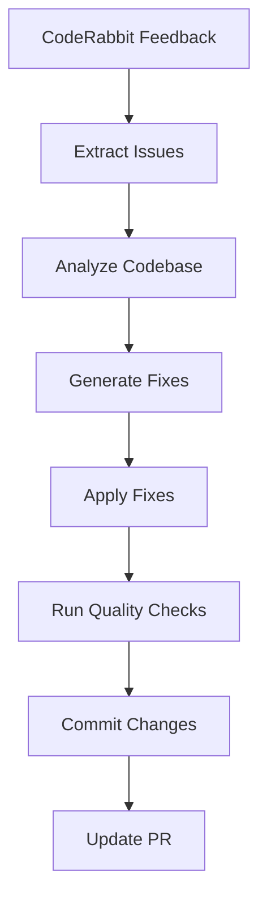

# CodeRabbit Backend Automation Workflow

## Overview

This GitHub Actions workflow automatically detects and resolves backend issues identified by CodeRabbit. It provides comprehensive automated fixes for common backend development problems.

## Features

### 🤖 Automated Issue Detection
- **Missing Imports**: Detects and adds missing import statements
- **Type Annotations**: Fixes TypeScript type annotation issues
- **Code Style**: Applies consistent formatting and linting
- **Security Vulnerabilities**: Identifies and resolves security concerns
- **Performance Issues**: Optimizes inefficient code patterns
- **Error Handling**: Adds proper try-catch blocks and error management
- **Null/Undefined Safety**: Implements optional chaining and null checks
- **Memory Leaks**: Identifies and fixes potential memory issues
- **API Design**: Improves REST API endpoint design

### 🔧 Automated Fixes

#### Type System Improvements
- Replaces `any` types with `unknown` for better type safety
- Adds return type annotations to functions
- Implements proper TypeScript interfaces

#### Error Handling Enhancement
- Wraps async functions with try-catch blocks
- Adds proper error logging and propagation
- Implements graceful error recovery

#### Code Safety Features
- Adds optional chaining (`?.`) for null-safe property access
- Implements null/undefined checks
- Adds input validation for functions

#### Performance Optimizations
- Identifies DOM queries in loops
- Detects unnecessary JSON serialization
- Finds uncleared intervals and timeouts

### 🛡️ Security & Validation

#### Security Scanning
- Automated npm audit for vulnerability detection
- Sensitive data pattern detection
- Code injection vulnerability checks

#### Quality Assurance
- TypeScript compilation validation
- Build process verification
- Test suite execution
- Performance impact assessment

## Workflow Triggers

The workflow automatically activates when:

1. **CodeRabbit Comments**: Any comment containing `@coderabbitai`
2. **CodeRabbit Reviews**: Pull request reviews from `coderabbitai[bot]`
3. **CodeRabbit Feedback**: Review comments from CodeRabbit

## Workflow Process



### Step-by-Step Process

1. **Feedback Extraction**: Parses CodeRabbit comments for backend issues
2. **Code Analysis**: Scans source files for identified problems
3. **Fix Generation**: Creates automated solutions for detected issues
4. **Quality Validation**: Ensures fixes don't break builds or tests
5. **Code Formatting**: Applies ESLint and Prettier formatting
6. **Change Commitment**: Commits fixes with descriptive messages
7. **PR Updates**: Posts summary of resolved issues

## Issue Resolution Examples

### Missing Type Annotations
```typescript
// Before
function processData(data) {
  return data.map(item => item.value);
}

// After
function processData(data: DataItem[]): number[] {
  return data.map(item => item.value);
}
```

### Error Handling
```typescript
// Before
async function fetchData(url) {
  const response = await fetch(url);
  return response.json();
}

// After
async function fetchData(url: string): Promise<any> {
  try {
    const response = await fetch(url);
    return response.json();
  } catch (error) {
    console.error("Error:", error);
    throw error;
  }
}
```

### Null Safety
```typescript
// Before
const userName = user.profile.name;

// After
const userName = user?.profile?.name;
```

## Configuration

### Environment Variables
- `GITHUB_TOKEN`: Automatically provided by GitHub Actions
- `NODE_VERSION`: Node.js version (default: 18)

### File Support
- TypeScript (`.ts`, `.tsx`)
- JavaScript (`.js`, `.jsx`)
- Source directories: `src/`, `lib/`, `app/`

### Quality Gates
- Build must pass after applying fixes
- Tests must continue to pass
- No new ESLint errors introduced
- TypeScript compilation must succeed

## Output Examples

### Success Report
```markdown
## 🤖 Automated CodeRabbit Issue Resolution

✅ **5 backend issues automatically resolved**

### Type Annotations
Fixed 2 issue(s):
- src/services/api.ts: Function missing return type annotation
- src/utils/helpers.ts: Found usage of "any" type which should be avoided

### Error Handling
Fixed 2 issue(s):
- src/services/authService.ts: Async function without error handling
- src/hooks/useData.ts: Async function without error handling

### Null Undefined
Fixed 1 issue(s):
- src/components/UserProfile.tsx: Potential null/undefined access without checks

### Quality Assurance
- Build Status: ✅ Success
- Tests Status: ✅ Pass
```

### Failure Handling
```markdown
## ⚠️ CodeRabbit Automation Issue

The automated CodeRabbit backend issue resolution workflow encountered an error.

**Workflow Status:** Failed
**Event:** pull_request_review
**Trigger:** CodeRabbit feedback detection

Please review the workflow logs and consider manual intervention for the reported issues.
```

## Best Practices

### When to Use
- ✅ CodeRabbit identifies common backend issues
- ✅ Type safety improvements needed
- ✅ Error handling gaps identified
- ✅ Code style inconsistencies found

### When to Review Manually
- ⚠️ Complex business logic changes
- ⚠️ Breaking API changes suggested
- ⚠️ Major architectural modifications
- ⚠️ Security-critical code sections

## Monitoring & Maintenance

### Success Metrics
- Issue resolution rate
- Build success after automation
- Test pass rate maintenance
- Manual intervention requirements

### Troubleshooting

#### Common Issues
1. **Build Failures**: Check TypeScript errors in workflow logs
2. **Test Failures**: Review test output for breaking changes
3. **Permission Errors**: Ensure proper GitHub token permissions
4. **Merge Conflicts**: Resolve manually if auto-merge fails

#### Debug Steps
1. Check workflow logs in GitHub Actions tab
2. Review `applied_fixes.json` for fix details
3. Validate code changes in PR diff
4. Run local build to reproduce issues

## Integration with Development Workflow

### Pre-merge Validation
- Automated fixes applied before manual review
- Quality gates ensure stability
- Documentation updates included

### Post-merge Monitoring
- Performance impact assessment
- Security vulnerability scanning
- Code coverage maintenance

## Future Enhancements

### Planned Features
- Machine learning-based fix suggestions
- Integration with additional code analysis tools
- Custom fix rule configuration
- Advanced performance optimization patterns
- Database query optimization detection

### Feedback Integration
- Developer feedback incorporation
- Fix success rate tracking
- Issue pattern analysis
- Custom rule development

## Support

For issues or questions about the CodeRabbit automation workflow:

1. Check workflow logs in GitHub Actions
2. Review this documentation
3. Create an issue in the repository
4. Contact the development team

---

*This automation workflow is designed to enhance development velocity while maintaining code quality and security standards.*