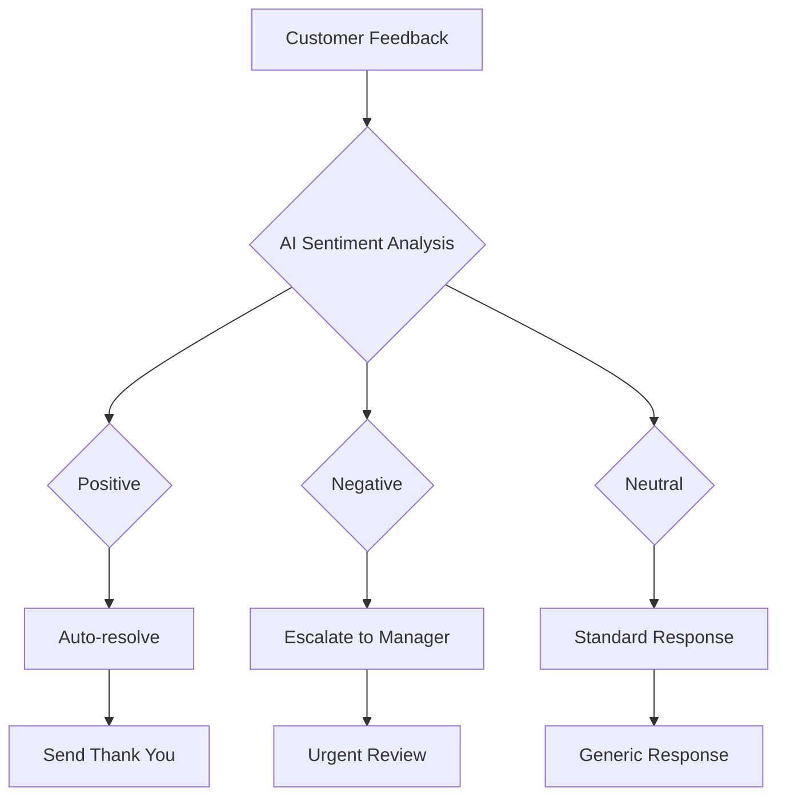
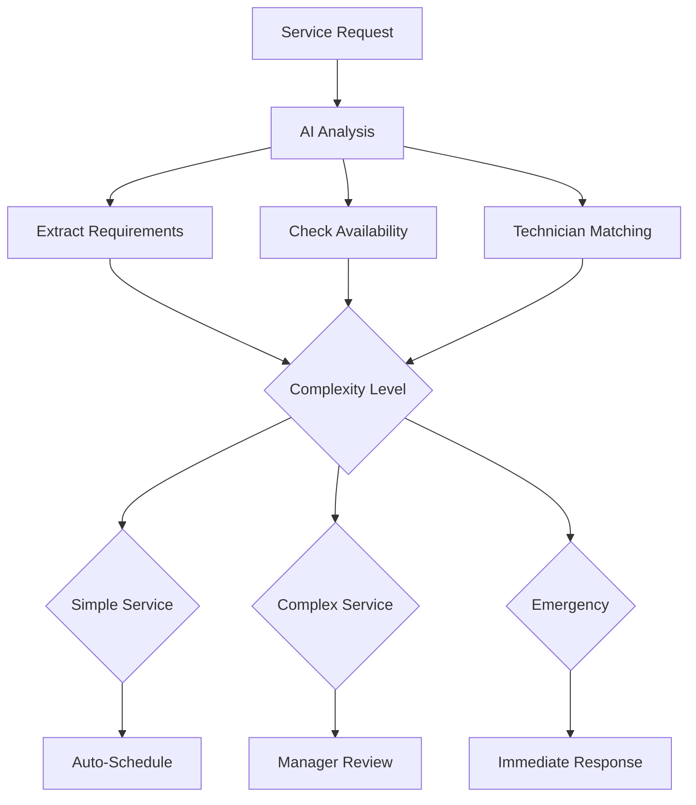
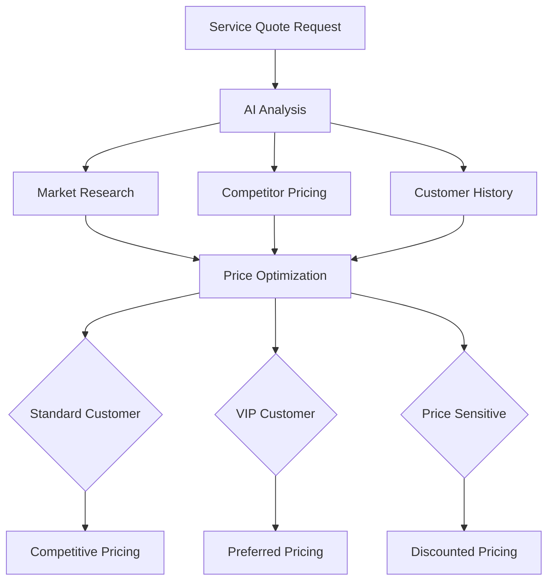

# Tutorial: Advanced AI Integration

## 🎯 Objective

Master advanced AI integration techniques in Auterity workflows. Learn to leverage multiple AI models, implement intelligent decision-making, and create sophisticated AI-powered automation that adapts to your dealership's unique needs.

## ⏱️ Time Required

**25-30 minutes**

## 📋 Prerequisites

- ✅ Completed "Creating Your First Workflow" tutorial
- ✅ Understanding of basic AI node usage
- ✅ Access to workflow editing permissions
- ✅ Sample data for testing (customer communications, service records)

## 🧠 What You'll Learn

- Advanced AI model selection and configuration
- Multi-model workflows with intelligent routing
- Prompt engineering for better results
- AI-powered decision making
- Error handling for AI operations
- Cost optimization strategies
- Custom AI model integration

---

## Step 1: Understanding AI Models in Auterity

### 1.1 Available AI Models

Auterity provides access to multiple AI models through our AI Router:

| Model | Best For | Strengths | Cost Level |
|-------|----------|-----------|------------|
| **GPT-4** | Complex reasoning, creative tasks | Most capable, best quality | High |
| **GPT-3.5 Turbo** | Fast processing, general tasks | Speed, cost-effective | Medium |
| **Claude 3** | Analysis, safety-critical tasks | Reliable, nuanced responses | High |
| **Claude 2** | Document analysis, long context | Strong analysis capabilities | Medium |
| **Custom Models** | Specialized tasks | Domain-specific expertise | Variable |

### 1.2 Model Selection Strategy

```typescript
// Decision framework for model selection
const selectAIModel = (task: AITask): AIModel => {
  switch (task.complexity) {
    case 'high':
      return task.needsCreativity ? 'gpt-4' : 'claude-3';
    case 'medium':
      return task.needsSpeed ? 'gpt-3.5-turbo' : 'claude-2';
    case 'low':
      return 'gpt-3.5-turbo'; // Most cost-effective
    default:
      return 'gpt-3.5-turbo'; // Safe default
  }
};
```

---

## Step 2: Building Multi-Model AI Workflows

### 2.1 Create Intelligent Model Router

1. **Start New Workflow**
   ```
   Name: AI Model Router
   Description: Intelligent routing to optimal AI models
   Category: AI Processing
   ```

2. **Add Input Analysis Node**
   ```
   Node Type: AI Processing → Text Analysis
   Model: GPT-3.5 Turbo (fast analysis)
   Task: Analyze input complexity and requirements
   Output: JSON with complexity score and task type
   ```

3. **Add Model Selection Logic**
   ```
   Node Type: Logic → Decision Split
   Conditions:
   - Complexity > 8 → GPT-4
   - Complexity 5-8 → Claude-3
   - Complexity < 5 → GPT-3.5 Turbo
   - Safety-critical → Claude-3 (override)
   ```

4. **Add Model Execution Nodes**
   ```
   For each model path:
   - GPT-4 Node: High-complexity processing
   - Claude-3 Node: Safe, analytical processing
   - GPT-3.5 Node: Fast, routine processing
   ```

### 2.2 Implement Cost Optimization

1. **Add Cost Tracking**
   ```
   Node Type: Analytics → Cost Tracker
   Track: Token usage, API calls, processing time
   Thresholds: Set budget limits per workflow
   ```

2. **Add Fallback Logic**
   ```
   If expensive model fails → Retry with cheaper model
   If cost exceeds budget → Use cached responses
   If processing timeout → Simplify prompt and retry
   ```

---

## Step 3: Advanced Prompt Engineering

### 3.1 Create Dynamic Prompts

1. **Add Prompt Builder Node**
   ```
   Node Type: Data → Text Formatter
   Purpose: Create context-aware prompts
   Variables: Customer data, task type, urgency level
   ```

2. **Implement Context Injection**
   ```
   Template: "You are a [Role] at [Dealership Name].
   Customer: [Customer Name] from [Location]
   Task: [Specific Task Description]
   Context: [Relevant Customer History]
   Requirements: [Specific Output Format]
   Constraints: [Business Rules, Compliance]"
   ```

### 3.2 Prompt Optimization Techniques

#### Chain of Thought Prompting
```
"You are an expert service advisor. Think step-by-step:

1. Analyze the customer's service history
2. Identify patterns in their vehicle issues
3. Consider seasonal factors and mileage
4. Recommend appropriate service schedule
5. Explain reasoning clearly to customer

Customer Data: [Insert customer information]
Output Format: JSON with recommendation and explanation"
```

#### Few-Shot Learning
```
"Examples of excellent customer emails:

Example 1:
Input: Customer complaining about wait time
Output: "I sincerely apologize for the inconvenience..."

Example 2:
Input: Customer requesting service quote
Output: "I'd be happy to provide a detailed quote..."

Now, generate a response for:
Input: [Customer Message]
Output: [Professional Response]"
```

#### Structured Output Prompts
```
"Analyze this customer service request and provide:

SERVICE_ANALYSIS: {
  "urgency_level": "high|medium|low",
  "service_type": "maintenance|repair|diagnostic",
  "estimated_duration": "X hours",
  "parts_required": ["part1", "part2"],
  "technician_skill_level": "1-5"
}

CUSTOMER_RESPONSE: {
  "tone": "professional|friendly|urgent",
  "key_points": ["point1", "point2"],
  "next_steps": ["step1", "step2"],
  "follow_up_timeline": "X hours/days"
}

Input: [Service Request Text]"
```

---

## Step 4: Intelligent Decision Making

### 4.1 Add AI-Powered Decisions

1. **Create Decision Analysis Node**
   ```
   Node Type: AI Processing → Decision Analysis
   Model: Claude-3 (for reliable decision making)
   Input: Multiple data sources (customer history, service data, business rules)
   Output: Structured decision with confidence score
   ```

2. **Implement Confidence Scoring**
   ```
   Decision Output Format:
   {
     "decision": "approve|deny|escalate",
     "confidence_score": 0.85,
     "reasoning": "Detailed explanation",
     "risk_factors": ["factor1", "factor2"],
     "recommendations": ["action1", "action2"]
   }
   ```

### 4.2 Add Human-in-the-Loop

1. **Add Approval Gateway**
   ```
   Node Type: Logic → Approval Gateway
   Conditions:
   - High confidence (>0.9) → Auto-approve
   - Medium confidence (0.7-0.9) → Manager review
   - Low confidence (<0.7) → Supervisor review
   ```

2. **Implement Escalation Logic**
   ```
   Escalation Rules:
   - Amount > $5000 → Manager approval
   - Rush service → Supervisor approval
   - VIP customer → Expedited review
   - Safety concern → Immediate supervisor notification
   ```

---

## Step 5: Error Handling & Resilience

### 5.1 AI-Specific Error Handling

1. **Add AI Error Detection**
   ```
   Node Type: Logic → Error Detector
   Detect: Model timeouts, API failures, invalid responses
   Actions: Retry, fallback model, human intervention
   ```

2. **Implement Circuit Breaker Pattern**
   ```
   Circuit Breaker Logic:
   - Success threshold: 95% success rate
   - Failure threshold: 5 consecutive failures
   - Recovery timeout: 5 minutes
   - Half-open state: Test with single request
   ```

### 5.2 Fallback Mechanisms

1. **Model Fallback Chain**
   ```
   Primary: GPT-4
   ↓ (if fails)
   Secondary: Claude-3
   ↓ (if fails)
   Tertiary: GPT-3.5 Turbo
   ↓ (if fails)
   Final: Cached/Template Response
   ```

2. **Response Validation**
   ```
   Validation Rules:
   - Response format matches expected schema
   - Required fields are present
   - Values are within acceptable ranges
   - No sensitive data leakage
   - Compliance with business rules
   ```

---

## Step 6: Performance Optimization

### 6.1 Caching Strategies

1. **Add Response Caching**
   ```
   Node Type: Data → Cache Manager
   Cache Key: Hash of input parameters
   TTL: 24 hours for similar requests
   Invalidation: Manual or time-based
   ```

2. **Implement Smart Caching**
   ```
   Cache Decision Logic:
   - Frequently requested data → Cache aggressively
   - Time-sensitive data → Short TTL
   - Personal data → No caching
   - Large responses → Compress before caching
   ```

### 6.2 Batch Processing

1. **Add Batch Processor**
   ```
   Node Type: Data → Batch Processor
   Batch Size: 10-50 items (model-dependent)
   Processing: Parallel execution
   Error Handling: Individual item failure doesn't stop batch
   ```

2. **Optimize for Cost**
   ```
   Cost Optimization:
   - Batch similar requests together
   - Use appropriate model for task complexity
   - Cache frequent responses
   - Monitor usage patterns
   ```

---

## Step 7: Custom AI Integration

### 7.1 Connect to Custom Models

1. **Add Custom Model Node**
   ```
   Node Type: AI Processing → Custom Model
   Endpoint: Your custom model API
   Authentication: API key or OAuth
   Input Format: Model-specific requirements
   Output Processing: Standardize response format
   ```

2. **Implement Model Registry**
   ```
   Model Registry:
   - Model capabilities and limitations
   - Performance benchmarks
   - Cost per request
   - Reliability metrics
   - Update procedures
   ```

### 7.2 Hybrid AI Approach

1. **Combine Multiple Models**
   ```
   Workflow Pattern:
   1. Fast model for initial analysis (GPT-3.5)
   2. Specialized model for domain tasks (Custom)
   3. Safety model for final validation (Claude)
   4. Human review for critical decisions
   ```

2. **Implement Model Ensemble**
   ```
   Ensemble Logic:
   - Multiple models process same input
   - Weighted voting for final decision
   - Confidence scoring for each model
   - Fallback to highest-confidence result
   ```

---

## Step 8: Monitoring & Analytics

### 8.1 AI Performance Monitoring

1. **Add AI Metrics Node**
   ```
   Track Metrics:
   - Response time by model
   - Success rate by task type
   - Cost per transaction
   - Error rate by model
   - User satisfaction scores
   ```

2. **Implement A/B Testing**
   ```
   A/B Test Framework:
   - Compare different models
   - Test prompt variations
   - Measure performance differences
   - Automated winner selection
   ```

### 8.2 Cost Management

1. **Add Cost Monitoring**
   ```
   Cost Tracking:
   - Real-time usage monitoring
   - Budget alerts and limits
   - Cost optimization recommendations
   - Usage forecasting
   - Chargeback to departments
   ```

2. **Implement Cost Controls**
   ```
   Cost Control Measures:
   - Usage quotas by department
   - Model selection based on cost
   - Caching to reduce API calls
   - Batch processing for efficiency
   ```

---

## Step 9: Real-World AI Workflow Examples

### 9.1 Customer Sentiment Analysis



### 9.2 Intelligent Service Scheduling



### 9.3 Dynamic Pricing Optimization



---

## 🎯 Learning Outcomes

After completing this tutorial, you can:

✅ **Select optimal AI models** for different tasks and complexity levels
✅ **Implement intelligent routing** between multiple AI models
✅ **Engineer effective prompts** using advanced techniques
✅ **Build decision-making workflows** with AI-powered logic
✅ **Handle AI errors gracefully** with fallback mechanisms
✅ **Optimize costs** through caching and batch processing
✅ **Monitor AI performance** with comprehensive analytics
✅ **Integrate custom AI models** into your workflows

## 🚀 Advanced Techniques to Explore

**Ready for Expert-Level AI Integration?**

1. **[Multi-Modal AI Tutorial](/docs/customer/tutorials/multi-modal-ai.md)**
   - Process images, text, and data together
   - Build comprehensive AI pipelines

2. **[AI Model Fine-Tuning](/docs/customer/tutorials/ai-fine-tuning.md)**
   - Customize models for your dealership data
   - Improve accuracy for specific use cases

3. **[AI Ethics & Bias Mitigation](/docs/customer/tutorials/ai-ethics.md)**
   - Ensure fair and unbiased AI decisions
   - Implement ethical AI practices

4. **[Real-Time AI Processing](/docs/customer/tutorials/real-time-ai.md)**
   - Streaming AI responses
   - Real-time decision making

## 📊 AI Best Practices

### Model Selection Guidelines
- **Accuracy Critical**: Use GPT-4 or Claude-3
- **Speed Priority**: Use GPT-3.5 Turbo
- **Cost Sensitive**: Use GPT-3.5 Turbo with caching
- **Safety Critical**: Use Claude models
- **Analysis Heavy**: Use Claude for document processing

### Cost Optimization Strategies
- **Cache Frequently Used Responses**: Reduce API calls by 40-60%
- **Use Appropriate Model Size**: Match model capability to task complexity
- **Batch Similar Requests**: Process multiple items together
- **Implement Usage Quotas**: Prevent cost overruns
- **Monitor and Alert**: Set up cost monitoring and alerts

### Performance Optimization
- **Parallel Processing**: Run independent AI tasks simultaneously
- **Streaming Responses**: Process results as they become available
- **Model Warm-up**: Keep frequently used models ready
- **Smart Routing**: Direct requests to optimal models
- **Load Balancing**: Distribute across multiple model instances

## 📞 AI Support Resources

- **AI Model Documentation**: `/docs/system/ai-integration.md`
- **Prompt Engineering Guide**: `/docs/customer/tutorials/prompt-engineering.md`
- **API Reference**: `/docs/system/api-contracts.md`
- **Cost Optimization Guide**: `/docs/customer/tutorials/cost-optimization.md`
- **AI Troubleshooting**: `/docs/customer/troubleshooting/ai-issues.md`

---

**Congratulations!** You've mastered advanced AI integration techniques. Your workflows now leverage the full power of multiple AI models with intelligent routing, error handling, and cost optimization.

*Tutorial Version: 1.3 | Last Updated: [Current Date] | Auterity Platform v1.2.3*
