# Page Flows & User Journey Documentation

## Overview

This document maps out the complete user journey through Auterity's application, detailing page flows, user interactions, and navigation patterns. It provides a comprehensive view of how users move through different screens and states within the platform.

## 🏠 Authentication Flow

### User Registration Flow
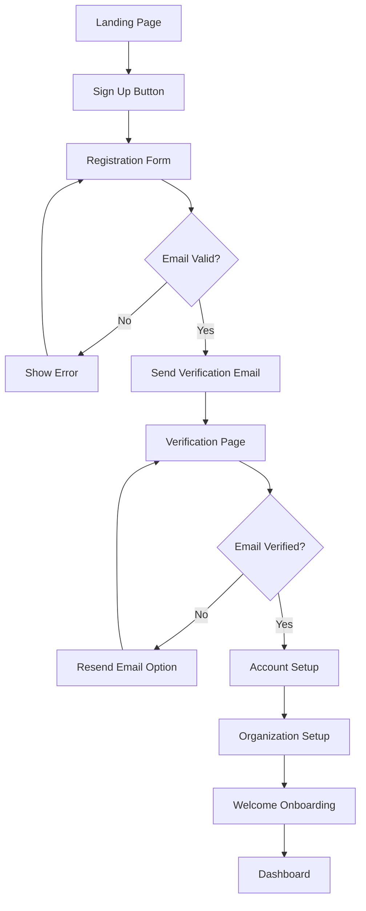

### Login Flow
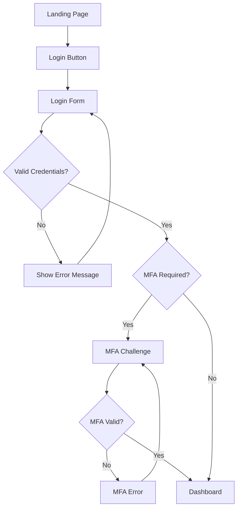

### Password Reset Flow
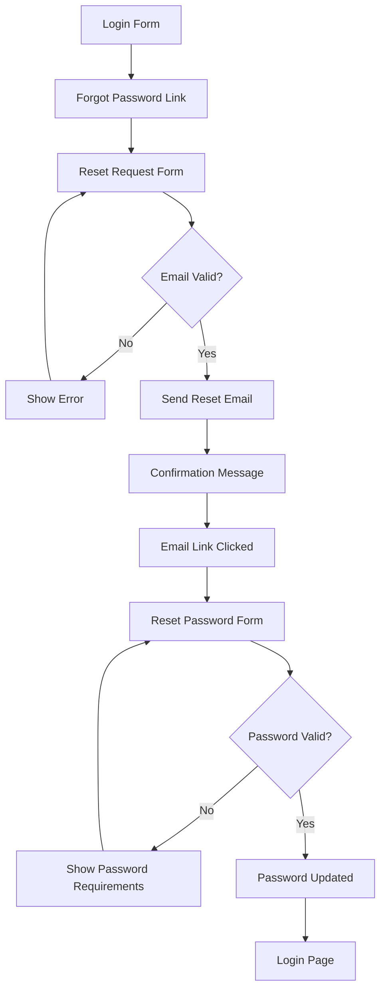

---

## 📊 Main Dashboard Flow

### Dashboard Navigation
```
┌─────────────────────────────────────────────────────────────┐
│                        Header Bar                           │
│ ┌─────┐ ┌─────────────┐ ┌─────┐ ┌─────┐ ┌─────────────┐     │
│ │Logo│ │Search Bar   │ │Notif│ │User │ │Org Switcher │     │
│ └─────┘ └─────────────┘ └─────┘ └─────┘ └─────────────┘     │
└─────────────────────────────────────────────────────────────┘
│                        Sidebar Menu                         │
│ ┌─────────────────────────────────────────────────────┐     │
│ │ 🏠 Dashboard                                        │     │
│ │ 🔄 Workflows                                         │     │
│ │ 🤖 AI Assistant                                       │     │
│ │ 📊 Analytics                                          │     │
│ │ 🛠️ Templates                                          │     │
│ │ 👥 Team                                               │     │
│ │ ⚙️ Settings                                           │     │
│ └─────────────────────────────────────────────────────┘     │
└─────────────────────────────────────────────────────────────┘
                        │
                        ▼
┌─────────────────────────────────────────────────────────────┐
│                     Main Content Area                       │
│                                                             │
│  ┌─ Recent Workflows ──────────────────┐  ┌─ Quick Stats ─┐ │
│  │ [Workflow 1] [Edit] [Run] [Delete]  │  │ Active: 12    │ │
│  │ [Workflow 2] [Edit] [Run] [Delete]  │  │ Completed: 45 │ │
│  │ [Workflow 3] [Edit] [Run] [Delete]  │  │ Failed: 2     │ │
│  │ [+ New Workflow]                     │  └───────────────┘ │
│  └─────────────────────────────────────┘                     │
│                                                             │
│  ┌─ Activity Feed ──────────────────────┐  ┌─ AI Insights ─┐ │
│  │ 🔄 Workflow 'Order Processing'       │  │ 💡 Suggestion │ │
│  │    completed successfully            │  │ Optimize step │ │
│  │ 👤 User joined team                  │  │ 3 for better  │ │
│  │ 🤖 AI model updated                  │  │ performance   │ │
│  └─────────────────────────────────────┘  └───────────────┘ │
└─────────────────────────────────────────────────────────────┘
```

### Dashboard Interaction Flow
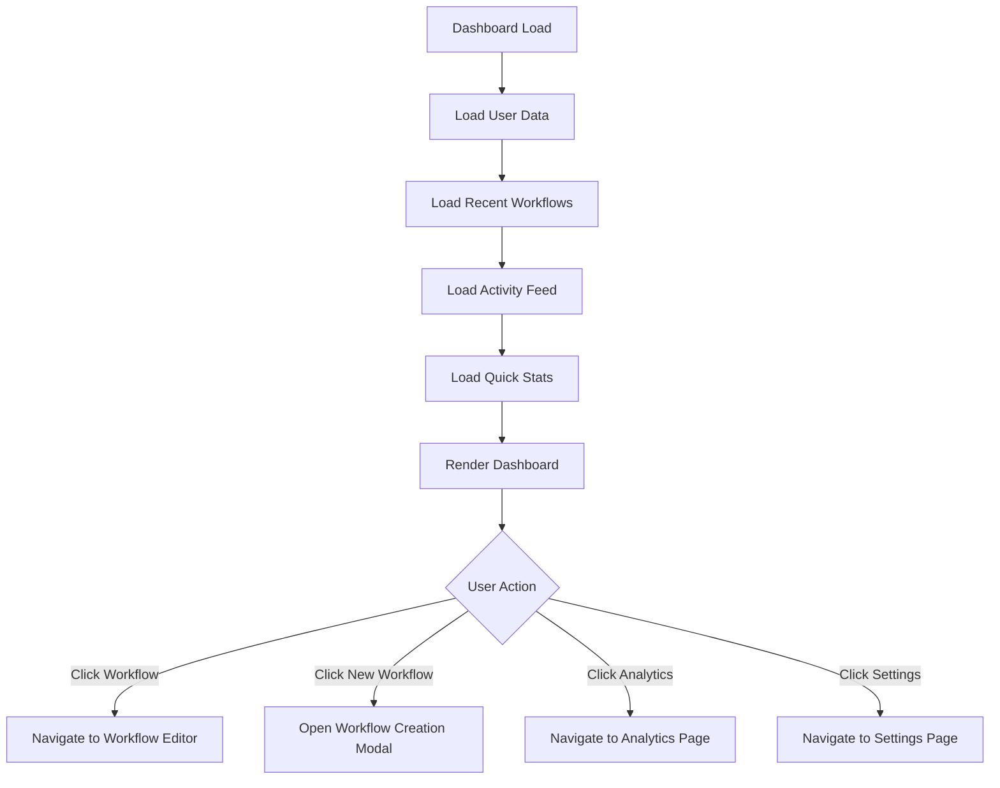

---

## 🔄 Workflow Studio Flow

### Workflow Creation Flow
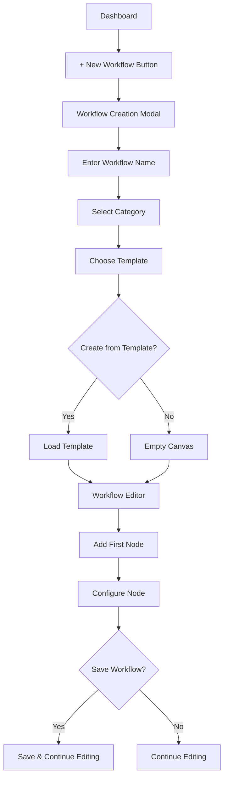

### Workflow Editor Interface
```
┌─────────────────────────────────────────────────────────────┐
│                    Workflow Editor Header                   │
│ ┌─────┐ ┌─────────────┐ ┌─────┐ ┌─────┐ ┌─────┐ ┌─────┐     │
│ │Back │ │Workflow Name│ │Save │ │Run  │ │Share│ │Delete│     │
│ └─────┘ └─────────────┘ └─────┘ └─────┘ └─────┘ └─────┘     │
└─────────────────────────────────────────────────────────────┘
│ ┌─ Node Palette ────────┐ ┌─ Canvas ──────────────────────┐ │
│ │ [+] AI Text Analysis  │ │                                 │ │
│ │ [+] Email Sender      │ │     ┌─────────────┐           │ │
│ │ [+] Data Transform    │ │     │  Start Node │           │ │
│ │ [+] Conditional Logic │ │     │             │           │ │
│ │ [+] API Integration   │ │     └─────┬───────┘           │ │
│ │                      │ │           │                   │ │
│ └──────────────────────┘ │     ┌─────▼───────┐           │ │
│                           │     │ AI Analysis │           │ │
│ ┌─ Properties Panel ──────┐     │             │           │ │
│ │ Selected Node:          │     └─────┬───────┘           │ │
│ │ AI Text Analysis        │           │                   │ │
│ │                         │     ┌─────▼───────┐           │ │
│ │ Model: GPT-4            │     │ Email Sender│           │ │
│ │ Temperature: 0.7        │     │             │           │ │
│ │ Max Tokens: 1000        │     └─────────────┘           │ │
│ │                         │                                 │ │
│ │ [Update] [Cancel]       │                                 │ │
│ └─────────────────────────┘                                 │ │
└─────────────────────────────────────────────────────────────┘
```

### Node Configuration Flow
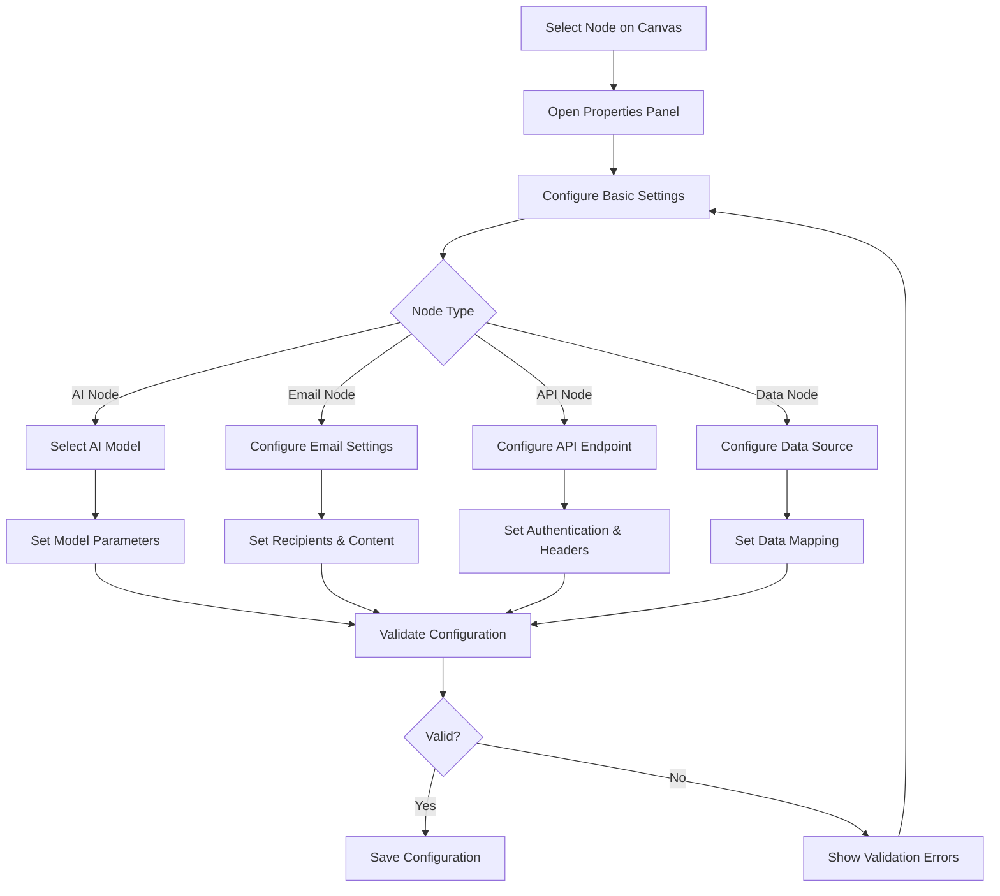

---

## 🤖 AI Assistant Flow

### AI Chat Interface
```
┌─────────────────────────────────────────────────────────────┐
│                   AI Assistant Header                       │
│ ┌─────┐ ┌─────────────────┐ ┌─────┐ ┌─────┐ ┌─────┐         │
│ │Back │ │AI Assistant     │ │Model │ │Clear│ │Help │         │
│ └─────┘ └─────────────────┘ └─────┘ └─────┘ └─────┘         │
└─────────────────────────────────────────────────────────────┘
│                                                             │
│ ┌─ Chat History ──────────────────────────────────────────┐ │
│ │ 🤖 Hello! I'm your AI assistant. How can I help you     │ │
│ │    today?                                                │ │
│ │                                                          │ │
│ │ 👤 Can you help me create a workflow for processing     │ │
│ │    customer support tickets?                             │ │
│ │                                                          │ │
│ │ 🤖 I'd be happy to help! Here's a workflow template...  │ │
│ │                                                          │ │
│ │ 👤 That looks great. Can you add email notifications?   │ │
│ │                                                          │ │
│ └─────────────────────────────────────────────────────────┘ │
│                                                             │
│ ┌─────────────────────────────────────────────────────────┐ │
│ │ Type your message here...                                │ │
│ │ ┌─────┐ ┌─────┐ ┌─────┐                                  │ │
│ │ │Send │ │Files│ │Voice│                                  │ │
│ │ └─────┘ └─────┘ └─────┘                                  │ │
│ └─────────────────────────────────────────────────────────┘ │
└─────────────────────────────────────────────────────────────┘
```

### AI Interaction Flow
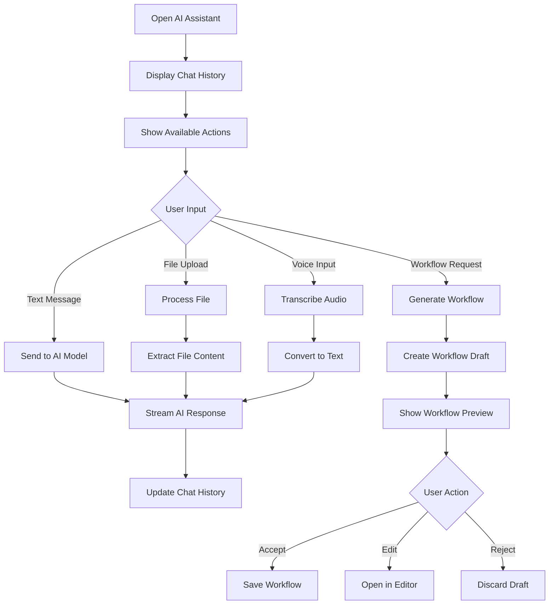

---

## 📊 Analytics Dashboard Flow

### Analytics Navigation
```
┌─────────────────────────────────────────────────────────────┐
│                   Analytics Dashboard                       │
│ ┌─────┐ ┌─────────────┐ ┌─────┐ ┌─────┐ ┌─────┐ ┌─────┐     │
│ │Back │ │Time Range   │ │Filter│ │Export│ │Share│ │Help │     │
│ └─────┘ └─────────────┘ └─────┘ └─────┘ └─────┘ └─────┘     │
└─────────────────────────────────────────────────────────────┘
│ ┌─ Key Metrics ──────────────────────┐ ┌─ Performance ───┐ │
│ │ Total Workflows: 1,234             │ │ Uptime: 99.9%   │ │
│ │ Active Users: 89                   │ │ Response Time:   │ │
│ │ Executions Today: 456              │ │ 245ms           │ │
│ │ Success Rate: 94.2%                │ │ Error Rate: 0.3%│ │
│ └────────────────────────────────────┘ └─────────────────┘ │
│                                                             │
│ ┌─ Charts & Visualizations ──────────────────────────────┐ │
│ │ ┌─ Workflow Executions ─┐ ┌─ User Activity ─┐           │ │
│ │ │     ████████          │ │     ███         │           │ │
│ │ │   ████████████        │ │   ██████        │           │ │
│ │ │ ███████████████       │ │ ████████        │           │ │
│ │ │█████████████████      │ │██████████       │           │ │
│ │ └─────────────────┘     │ └──────────┘     │           │ │
│ └─────────────────────────────────────────────────────────┘ │
│                                                             │
│ ┌─ Detailed Reports ──────────────────────────────────────┐ │
│ │ ┌─ Top Workflows ─┐ ┌─ Error Summary ─┐ ┌─ AI Usage ──┐ │ │
│ │ │ 1. Order Proc.. │ │ API Timeout: 12 │ │ GPT-4: 45%  │ │
│ │ │ 2. Support Tri. │ │ Auth Error: 8   │ │ Claude: 30%  │ │
│ │ │ 3. Data Sync... │ │ Network: 5      │ │ GPT-3.5: 25%│ │
│ │ └─────────────────┘ └─────────────────┘ └─────────────┘ │ │
│ └─────────────────────────────────────────────────────────┘ │
└─────────────────────────────────────────────────────────────┘
```

### Analytics Drill-Down Flow
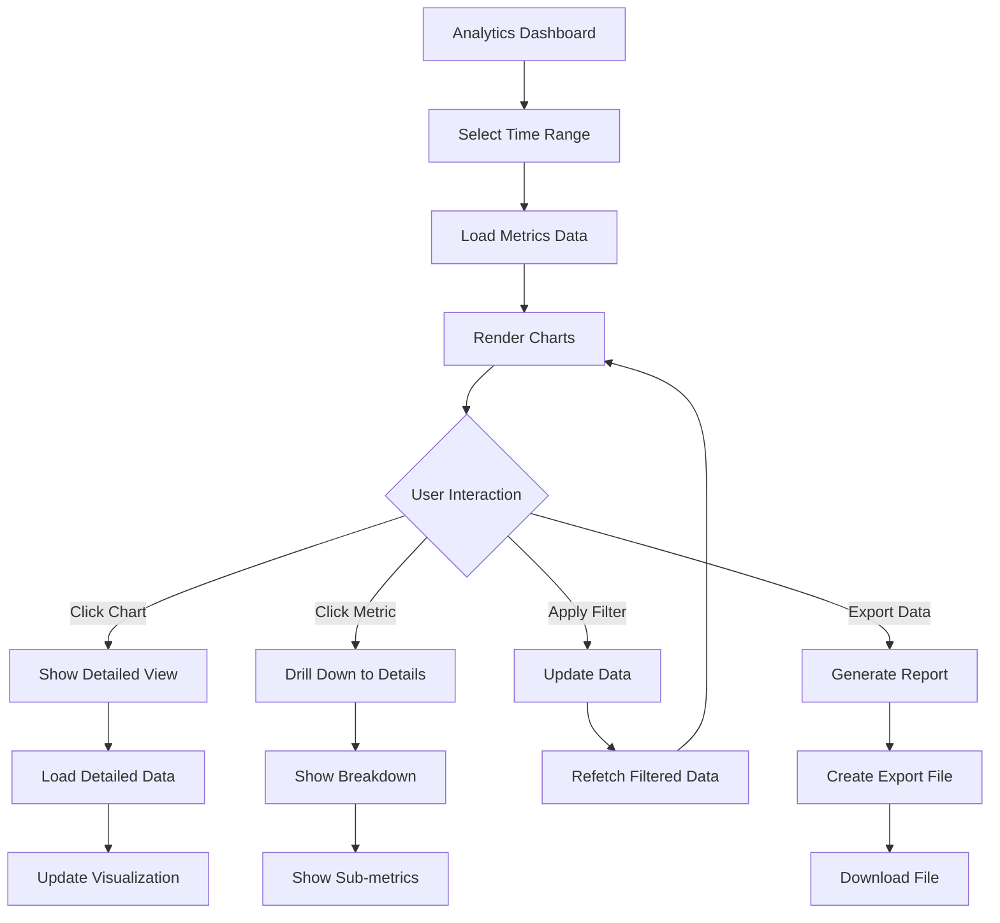

---

## 🛠️ Template Marketplace Flow

### Template Discovery
```
┌─────────────────────────────────────────────────────────────┐
│                 Template Marketplace                        │
│ ┌─────┐ ┌─────────────┐ ┌─────┐ ┌─────┐ ┌─────┐ ┌─────┐     │
│ │Back │ │Search       │ │Filter│ │Sort │ │My   │ │Create│     │
│ └─────┘ └─────────────┘ └─────┘ └─────┘ └─────┘ └─────┘     │
└─────────────────────────────────────────────────────────────┘
│ ┌─ Categories ──────┐ ┌─ Featured Templates ─────────────┐ │
│ │ 🏪 Sales          │ │ ┌─────────────────────────────┐   │ │
│ │ 🎧 Support        │ │ │ Customer Onboarding         │   │ │
│ │ 📦 Operations     │ │ │ ★★★★☆ (124 reviews)       │   │ │
│ │ 🔄 Integration    │ │ │ Automate welcome emails...  │   │ │
│ │ 📊 Analytics      │ │ │ [Preview] [Use Template]   │   │ │
│ │                   │ │ └─────────────────────────────┘   │ │
│ └───────────────────┘ └───────────────────────────────────┘ │
│                                                             │
│ ┌─ Popular Templates ─────────────────────────────────────┐ │
│ │ ┌─────────────────────────────┐ ┌─────────────────────┐ │ │
│ │ │ Order Processing Workflow   │ │ Email Notification  │ │ │
│ │ │ ★★★★★ (89 reviews)         │ │ ★★★★☆ (56 reviews) │ │ │
│ │ │ Process customer orders...  │ │ Send automated...   │ │ │
│ │ │ [Preview] [Use Template]    │ │ [Preview] [Use]     │ │ │
│ │ └─────────────────────────────┘ └─────────────────────┘ │ │
│ └─────────────────────────────────────────────────────────┘ │
└─────────────────────────────────────────────────────────────┘
```

### Template Usage Flow
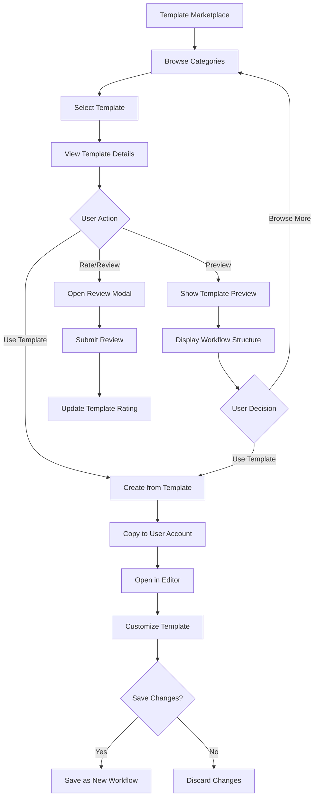

---

## ⚙️ Settings & Administration Flow

### Settings Navigation
```
┌─────────────────────────────────────────────────────────────┐
│                     Settings Page                          │
│ ┌─────┐ ┌─────────────┐                                     │
│ │Back │ │Settings      │                                     │
│ └─────┘ └─────────────┘                                     │
└─────────────────────────────────────────────────────────────┘
│ ┌─ Settings Menu ───┐ ┌─ Account Settings ───────────────┐ │
│ │ 👤 Account        │ │                                     │ │
│ │ 🏢 Organization   │ │ Name: John Doe                     │ │
│ │ 🔐 Security       │ │ Email: john@company.com           │ │
│ │ 🔔 Notifications  │ │ Role: Workflow Manager            │ │
│ │ 🔗 Integrations   │ │                                     │ │
│ │ 💳 Billing        │ │ [Edit Profile] [Change Password]   │ │
│ │ 👥 Team           │ │                                     │ │
│ └───────────────────┘ └─────────────────────────────────────┘ │
└─────────────────────────────────────────────────────────────┘
```

### Settings Configuration Flow
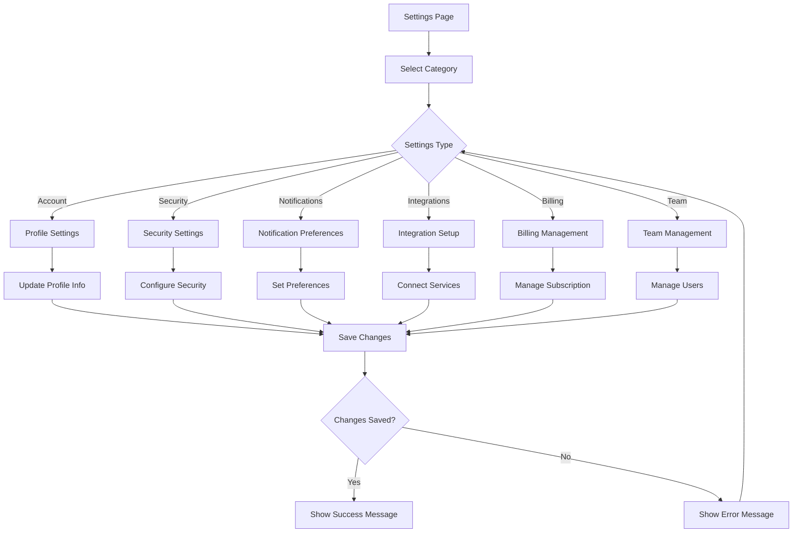

---

## 📱 Mobile & Responsive Flows

### Mobile Navigation Pattern
```
┌─────────────────────────────────────────────────────────────┐
│ Mobile Dashboard                                           │
├─────────────────────────────────────────────────────────────┤
│ ┌─ Header ──────────────────────────────────────────────┐ │
│ │ ☰ [Menu]     Auterity         👤 [Profile]           │ │
│ └───────────────────────────────────────────────────────┘ │
├─────────────────────────────────────────────────────────────┤
│ ┌─ Quick Actions ──────────────────────────────────────┐ │
│ │ [+] New Workflow    📊 Analytics    🛠️ Templates    │ │
│ └───────────────────────────────────────────────────────┘ │
├─────────────────────────────────────────────────────────────┤
│ ┌─ Recent Activity ────────────────────────────────────┐ │
│ │ 🔄 Order Processing completed 2m ago               │ │
│ │ 👤 Sarah joined the team                            │ │
│ │ 🤖 AI model updated                                 │ │
│ │ [+] Load More                                        │ │
│ └───────────────────────────────────────────────────────┘ │
├─────────────────────────────────────────────────────────────┤
│ ┌─ Bottom Navigation ──────────────────────────────────┐ │
│ │ 🏠 Home    🔄 Workflows    🤖 AI    📊 Analytics     │ │
│ └───────────────────────────────────────────────────────┘ │
└─────────────────────────────────────────────────────────────┘
```

### Mobile Interaction Flow
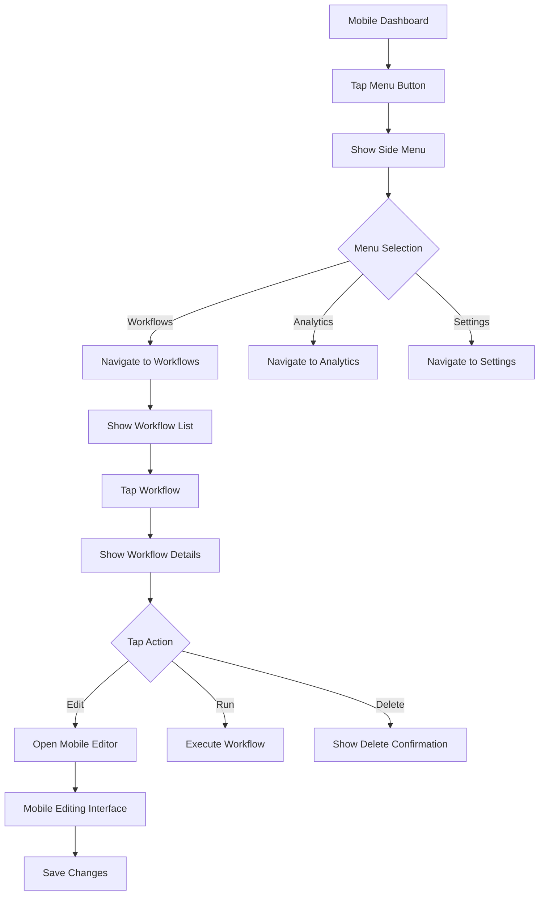

---

## 🚨 Error & Edge Case Flows

### Error Handling Flow
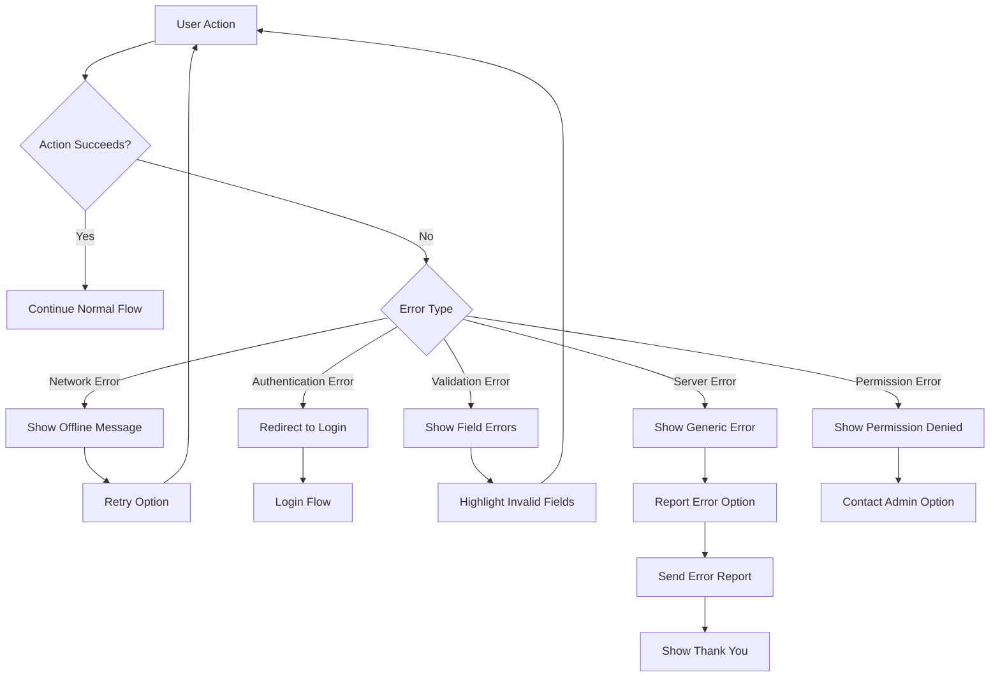

### Loading States Flow
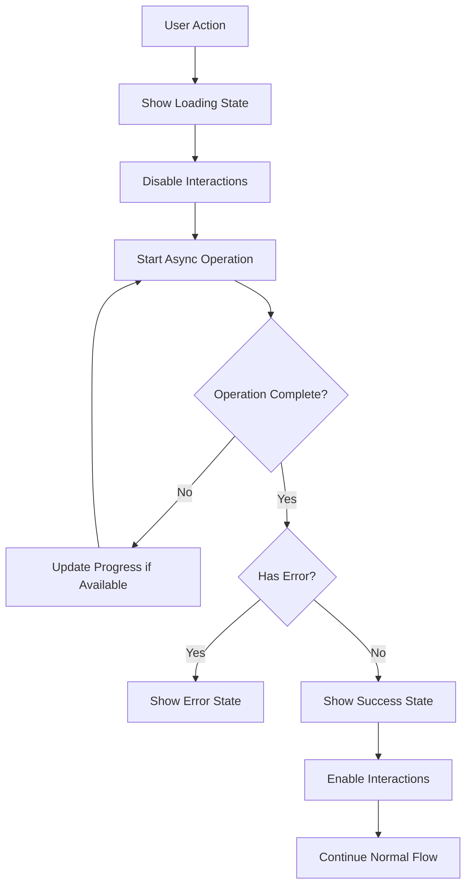

---

## 🔄 Cross-Platform Synchronization

### Multi-Device Sync Flow
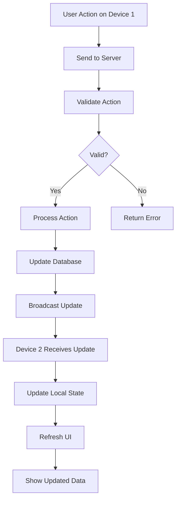

### Offline Support Flow
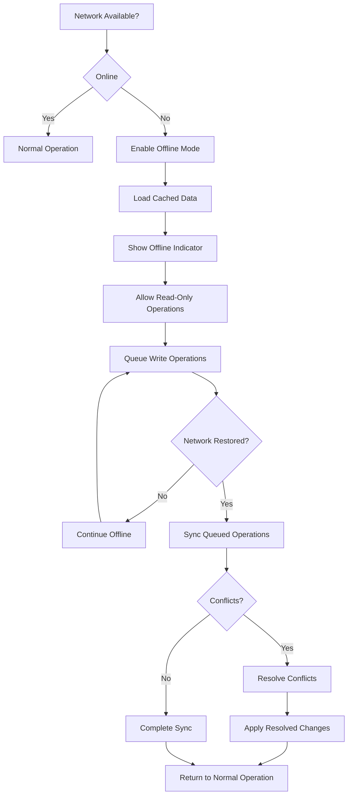

---

*This page flows and user journey documentation provides a comprehensive view of how users navigate through Auterity's interface. It serves as a reference for understanding user experience patterns, identifying potential friction points, and guiding interface improvements.*

*Last Updated: [Current Date] | Version: 1.2.3*
