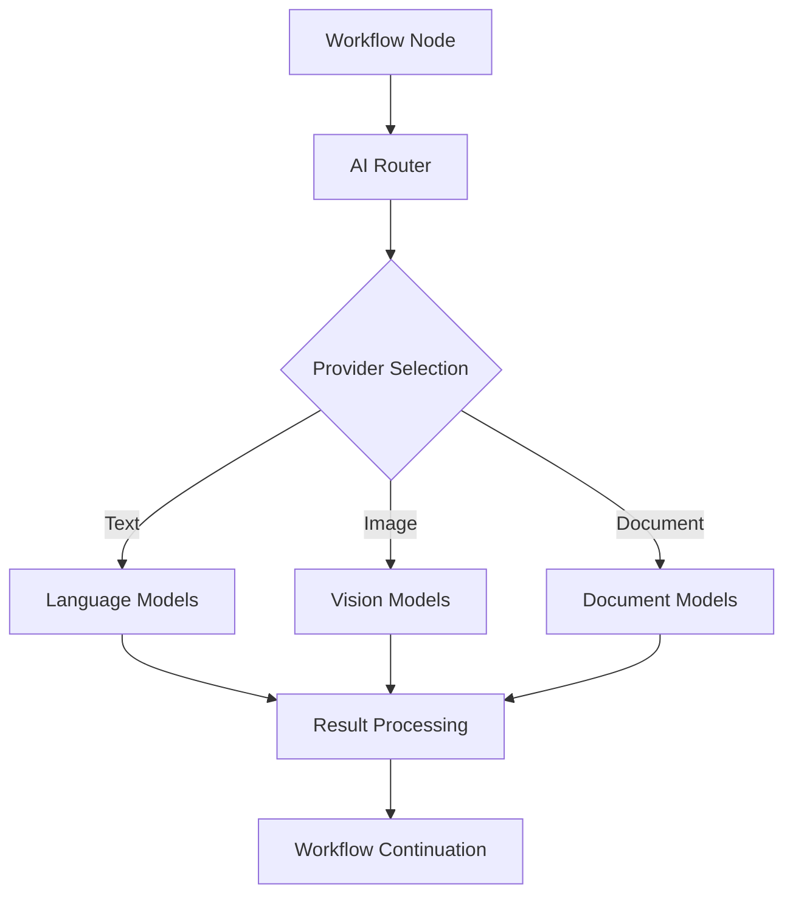
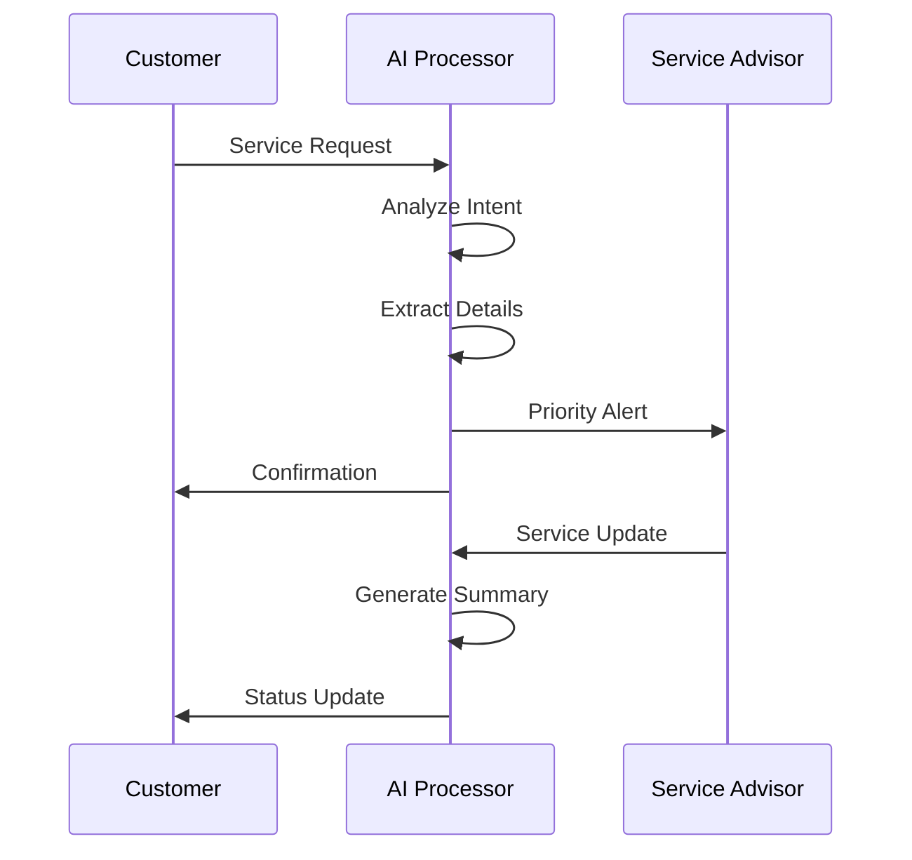
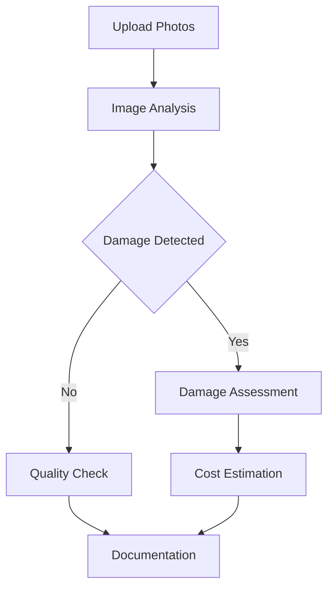

# AI-Powered Automation

## Overview

AI-Powered Automation is a core feature of the Auterity platform that integrates advanced artificial intelligence capabilities into workflow automation. This feature enables dealerships to leverage state-of-the-art language models, computer vision, and machine learning to automate complex tasks, enhance customer interactions, and optimize business processes.

## User Story

As a dealership service advisor, I want to automate customer communication and document processing using AI, so I can provide faster, more personalized service while reducing manual effort and errors.

## Key Features

### 1. Natural Language Processing
- **Text Analysis**: Extract key information from customer communications
- **Sentiment Analysis**: Gauge customer satisfaction and intent
- **Language Generation**: Create personalized responses and summaries
- **Multi-language Support**: Process content in multiple languages
- **Intent Recognition**: Understand customer requests and queries

### 2. Document Processing
- **Information Extraction**: Parse service records and invoices
- **Form Processing**: Automated form filling and validation
- **Document Classification**: Categorize incoming documents
- **Data Validation**: Verify extracted information accuracy
- **Template Matching**: Match documents to predefined templates

### 3. Image Analysis
- **Vehicle Damage Assessment**: Analyze service photos
- **VIN Recognition**: Extract VIN from images
- **Part Identification**: Recognize vehicle parts in images
- **Quality Control**: Verify repair work completion
- **Image Enhancement**: Improve photo quality for documentation

### 4. Intelligent Automation
- **Smart Routing**: Direct inquiries to appropriate departments
- **Priority Assessment**: Determine task urgency and priority
- **Decision Support**: AI-powered recommendations
- **Anomaly Detection**: Identify unusual patterns or issues
- **Predictive Analytics**: Forecast service needs and trends

## Technical Specifications

### AI Models & Providers

#### Language Models
- **OpenAI GPT-4**: Advanced text processing and generation
- **Anthropic Claude**: Constitutional AI for safety-critical tasks
- **Azure OpenAI**: Enterprise-grade language processing
- **Custom Models**: Domain-specific fine-tuned models

#### Computer Vision
- **Azure Computer Vision**: Image analysis and recognition
- **Google Cloud Vision**: Vehicle damage assessment
- **Custom Vision Models**: Specialized automotive detection

#### Document Processing
- **Azure Form Recognizer**: Automated form processing
- **Google Document AI**: Advanced document analysis
- **Custom OCR Models**: Specialized document extraction

### Integration Architecture



### Performance Metrics
- Response Time: <2 seconds for text, <5 seconds for images
- Accuracy: >95% for text, >90% for images
- Throughput: 100+ concurrent requests
- Availability: 99.9% uptime

## Use Cases

### 1. Service Communication Automation

#### Workflow Example


#### Features Used
- Intent recognition
- Information extraction
- Response generation
- Priority assessment

### 2. Vehicle Inspection Processing

#### Workflow Example


#### Features Used
- Image analysis
- Damage detection
- Cost estimation
- Documentation generation

## Implementation Guide

### 1. AI Node Configuration

```typescript
interface AINodeConfig {
  provider: 'openai' | 'anthropic' | 'azure';
  model: string;
  task_type: 'text' | 'image' | 'document';
  parameters: {
    temperature?: number;
    max_tokens?: number;
    timeout?: number;
    retry_count?: number;
  };
  input_mapping: {
    source: string;
    preprocessing?: string[];
  };
  output_mapping: {
    target: string;
    postprocessing?: string[];
  };
}
```

### 2. Model Selection Guidelines

| Task Type | Recommended Model | Alternative |
|-----------|------------------|-------------|
| General Text | GPT-4 | Claude-3 |
| Critical Decisions | Claude-3 | GPT-4 |
| Image Analysis | Azure Vision | Custom Model |
| Document Processing | Form Recognizer | Document AI |

### 3. Error Handling

```typescript
interface AIErrorHandling {
  retry_strategy: {
    max_attempts: number;
    backoff_ms: number;
    jitter: boolean;
  };
  fallback_options: {
    alternative_model?: string;
    default_response?: string;
    human_review?: boolean;
  };
  monitoring: {
    error_tracking: boolean;
    performance_metrics: boolean;
    cost_tracking: boolean;
  };
}
```

## Best Practices

### 1. Model Usage
- Use appropriate models for task complexity
- Implement proper error handling and retries
- Monitor usage and costs
- Regular model performance evaluation

### 2. Content Processing
- Validate input data quality
- Implement preprocessing steps
- Handle multi-language content
- Maintain content security

### 3. Integration
- Use asynchronous processing for long tasks
- Implement proper rate limiting
- Monitor API quotas and usage
- Regular performance optimization

### 4. Security & Compliance
- Data encryption in transit and at rest
- PII handling compliance
- Audit logging of AI operations
- Regular security reviews

## Success Metrics

### Performance Indicators
- Response time distribution
- Model accuracy rates
- Error rates and types
- Cost per transaction

### Business Impact
- Time saved per process
- Error reduction percentage
- Customer satisfaction improvement
- ROI on AI implementation

### Usage Analytics
- Feature utilization rates
- Model usage distribution
- Common use cases
- User adoption metrics

## Monitoring & Maintenance

### 1. Performance Monitoring
- Real-time response tracking
- Error rate monitoring
- Resource utilization
- Cost tracking

### 2. Quality Assurance
- Regular accuracy assessments
- Model performance reviews
- User feedback analysis
- Continuous improvement

### 3. Maintenance Tasks
- Model updates and versioning
- Configuration optimization
- Performance tuning
- Security updates

## Future Enhancements

### Planned Features
- Advanced model customization
- Enhanced multi-modal processing
- Improved cost optimization
- Extended language support

### Under Consideration
- Real-time video analysis
- Voice processing integration
- Automated model selection
- Advanced analytics dashboard

## Support Resources

### Documentation
- [AI Integration Guide](/docs/system/ai-integration.md)
- [Model Selection Guide](/docs/customer/tutorials/ai-model-selection.md)
- [Best Practices](/docs/customer/tutorials/ai-best-practices.md)
- [Troubleshooting](/docs/customer/troubleshooting.md)

### Training
- AI feature workshops
- Implementation guides
- Use case examples
- Performance optimization

### Support Channels
- Technical support
- AI expertise consultation
- Performance optimization
- Custom model development

---

*This documentation provides a comprehensive overview of the AI-Powered Automation feature. Regular updates will be made to reflect new capabilities and best practices.*
