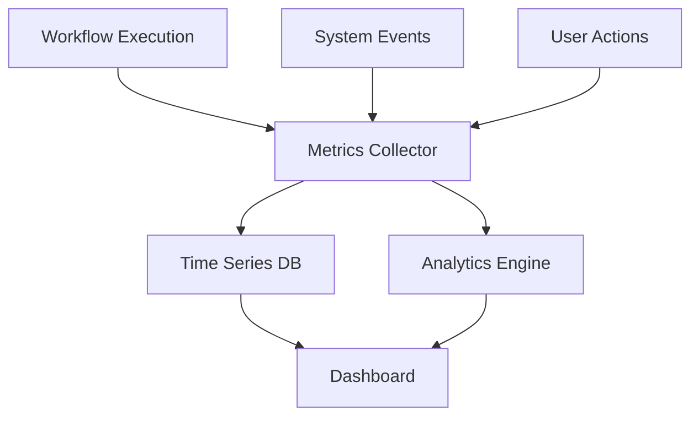
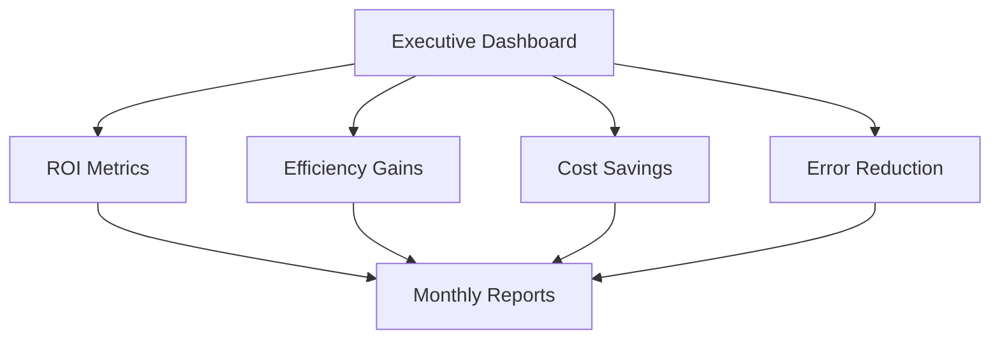
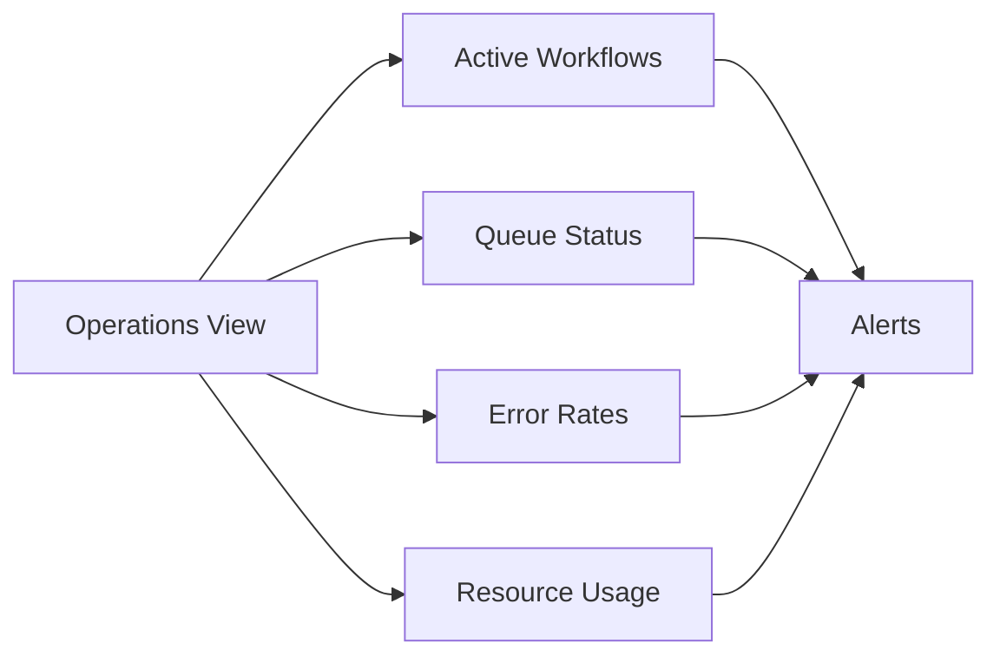
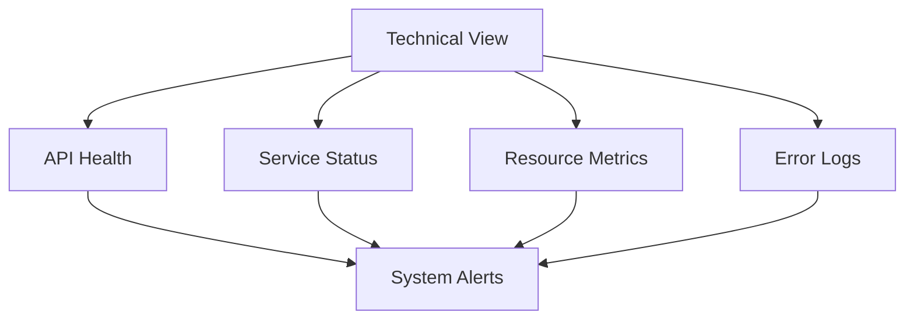

# Analytics Dashboard

## Overview

The Analytics Dashboard provides comprehensive insights into workflow performance, system health, and business metrics. This feature enables dealership managers and operators to monitor automation efficiency, track ROI, and make data-driven decisions for process optimization.

## User Story

As a dealership operations manager, I want to monitor workflow performance and business metrics in real-time, so I can optimize our processes and demonstrate the value of our automation investments.

## Key Features

### 1. Performance Analytics

#### Workflow Metrics
- Execution success rates
- Processing times
- Error frequencies
- Resource utilization
- Cost per execution

#### System Health
- API response times
- Service availability
- Resource consumption
- Error rates
- Integration status

#### Business Impact
- Time saved
- Cost reduction
- Error prevention
- Customer satisfaction
- ROI calculations

### 2. Real-Time Monitoring

#### Live Dashboards
- Active workflows
- Current executions
- System status
- Resource usage
- Alert notifications

#### Performance Tracking
- Response times
- Queue lengths
- Error rates
- Resource allocation
- Bottleneck detection

### 3. Historical Analysis

#### Trend Analysis
- Performance patterns
- Usage trends
- Error patterns
- Cost trends
- Optimization opportunities

#### Comparative Analysis
- Template performance
- Department efficiency
- Cost comparisons
- Time savings
- Error reduction

## Dashboard Architecture

### 1. Data Collection



### 2. Metrics Schema

```typescript
interface PerformanceMetrics {
  workflow_id: string;
  execution_id: string;
  timestamp: string;
  duration_ms: number;
  status: ExecutionStatus;
  error_count: number;
  resource_usage: {
    cpu_percent: number;
    memory_mb: number;
    api_calls: number;
  };
  cost_data: {
    ai_cost: number;
    api_cost: number;
    total_cost: number;
  };
}

interface BusinessMetrics {
  workflow_type: string;
  department: string;
  time_saved: number;
  cost_saved: number;
  error_prevention: number;
  customer_satisfaction: number;
  roi_percentage: number;
}
```

## Dashboard Views

### 1. Executive Dashboard

#### Key Metrics


#### Features
- High-level KPIs
- Trend visualization
- Department comparisons
- Cost analysis
- ROI calculations

### 2. Operations Dashboard

#### Workflow Monitoring


#### Features
- Real-time monitoring
- Performance metrics
- Resource tracking
- Alert management
- Issue resolution

### 3. Technical Dashboard

#### System Health


#### Features
- System metrics
- API monitoring
- Log analysis
- Error tracking
- Performance tuning

## Implementation Guide

### 1. Dashboard Configuration

```typescript
interface DashboardConfig {
  views: {
    [key: string]: {
      metrics: string[];
      refresh_rate: number;
      alert_thresholds: Record<string, number>;
      visualization_type: string;
    };
  };
  data_retention: {
    real_time_data: string; // e.g., "24h"
    historical_data: string; // e.g., "90d"
    aggregated_data: string; // e.g., "1y"
  };
  alert_config: {
    notification_channels: string[];
    severity_levels: string[];
    escalation_rules: EscalationRule[];
  };
}
```

### 2. Metric Collection

```typescript
interface MetricCollector {
  collect_interval: number;
  batch_size: number;
  buffer_size: number;
  retry_config: {
    max_attempts: number;
    backoff_ms: number;
  };
  processors: MetricProcessor[];
}
```

## Visualization Types

### 1. Time Series Charts
- Line graphs for trends
- Area charts for volumes
- Stacked charts for comparisons
- Real-time updates
- Interactive zooming

### 2. Statistical Displays
- Box plots
- Histograms
- Heat maps
- Scatter plots
- Correlation matrices

### 3. Business Metrics
- Gauge charts
- Progress bars
- KPI cards
- Comparison tables
- Trend indicators

## Alert System

### 1. Alert Configuration

```typescript
interface AlertConfig {
  metric: string;
  condition: {
    operator: 'gt' | 'lt' | 'eq' | 'ne';
    threshold: number;
    duration: string;
  };
  severity: 'info' | 'warning' | 'critical';
  notification: {
    channels: string[];
    message_template: string;
    escalation_policy: string;
  };
}
```

### 2. Alert Types
- Performance degradation
- Error rate spikes
- Resource exhaustion
- Cost anomalies
- System outages

### 3. Notification Channels
- Email alerts
- SMS notifications
- Slack integration
- Teams messages
- Mobile push notifications

## Reporting System

### 1. Report Types

#### Standard Reports
- Daily operations
- Weekly performance
- Monthly trends
- Quarterly business impact
- Annual ROI analysis

#### Custom Reports
- Department-specific metrics
- Process optimization
- Cost analysis
- Compliance tracking
- Customer impact

### 2. Export Options
- PDF generation
- Excel exports
- CSV data
- API access
- Scheduled delivery

## Best Practices

### 1. Dashboard Design
- Focus on key metrics
- Logical grouping
- Clear visualization
- Interactive elements
- Mobile responsiveness

### 2. Performance Optimization
- Efficient data collection
- Proper aggregation
- Caching strategy
- Query optimization
- Resource management

### 3. Maintenance
- Regular updates
- Data cleanup
- Performance tuning
- User feedback
- Feature enhancement

## Success Metrics

### 1. Usage Analytics
- Dashboard adoption
- Feature utilization
- Report generation
- Alert response
- User engagement

### 2. Performance Indicators
- Data freshness
- Query performance
- System reliability
- Alert accuracy
- Report delivery

### 3. Business Impact
- Decision making
- Process optimization
- Cost reduction
- Time savings
- User satisfaction

## Support Resources

### Documentation
- [User Guide](/docs/customer/analytics/dashboard-guide.md)
- [Metrics Dictionary](/docs/customer/analytics/metrics-reference.md)
- [Alert Configuration](/docs/customer/analytics/alert-setup.md)
- [Report Templates](/docs/customer/analytics/report-templates.md)

### Training
- Dashboard workshops
- Metrics analysis
- Alert management
- Report creation
- Advanced analytics

### Support
- Technical assistance
- Custom report creation
- Dashboard optimization
- Alert configuration
- Training resources

## Future Enhancements

### Planned Features
- Advanced analytics
- AI-powered insights
- Custom dashboards
- Enhanced reporting
- Mobile app

### Under Consideration
- Predictive analytics
- Machine learning integration
- Natural language queries
- AR/VR visualization
- Blockchain integration

## Maintenance & Updates

### 1. Regular Updates
- Feature enhancements
- Performance optimization
- Security patches
- Bug fixes
- Documentation updates

### 2. Data Management
- Archival strategy
- Cleanup procedures
- Backup systems
- Recovery plans
- Audit trails

### 3. Quality Assurance
- Performance testing
- Data accuracy
- Alert validation
- Report verification
- User feedback

---

*This documentation provides a comprehensive overview of the Analytics Dashboard feature. Regular updates will be made to reflect new capabilities and best practices.*
