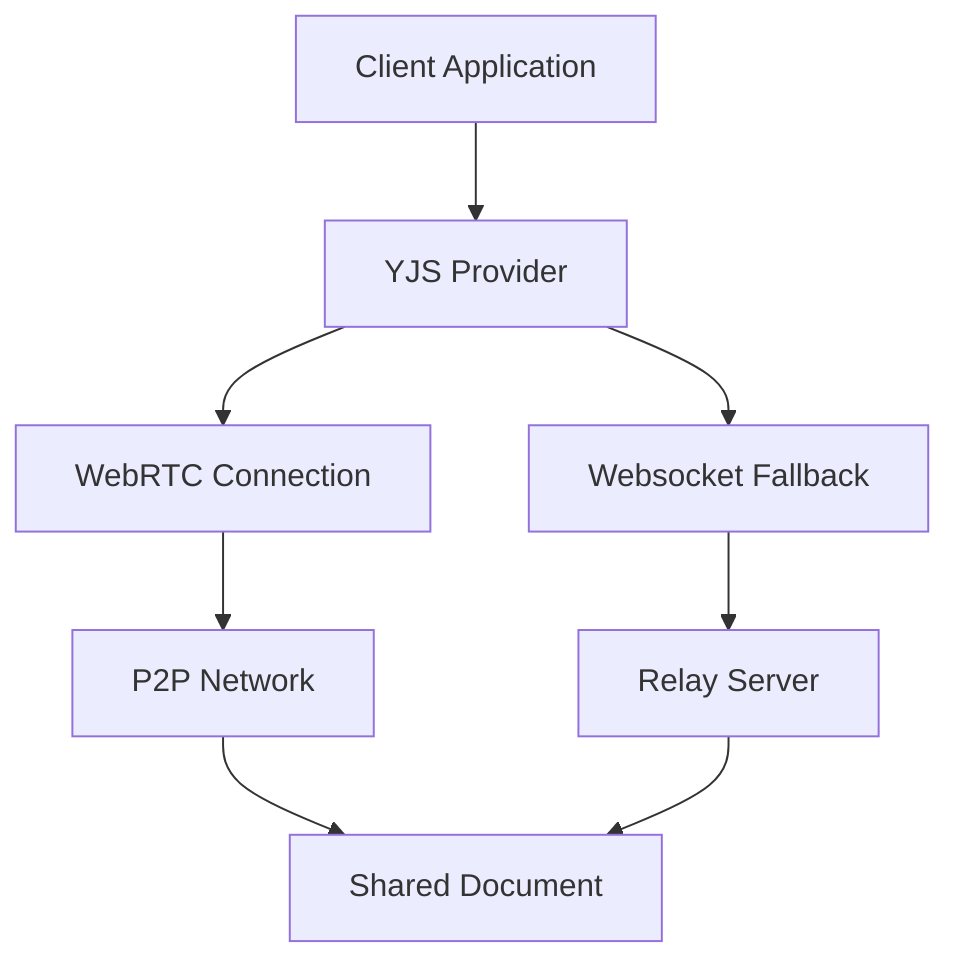

# Real-Time Collaboration

## Overview

The Real-Time Collaboration feature enables multiple users to simultaneously work on workflow designs, providing a seamless, Google Docs-like experience for workflow creation and editing. Built on YJS and WebRTC technology, it supports enterprise-grade collaboration with presence awareness, conflict resolution, and version control.

## User Story

As a dealership team leader, I want my team to collaborate on workflow design in real-time, so we can efficiently create and refine processes while maintaining consistency and quality.

## Key Features

### 1. Collaborative Editing

#### Real-Time Synchronization
- Simultaneous editing
- Instant updates
- Conflict resolution
- Change tracking
- Undo/redo support

#### User Presence
- Active user indicators
- Cursor positions
- Selection highlighting
- User avatars
- Status indicators

#### Change Management
- Version history
- Change annotations
- Rollback capability
- Branching support
- Merge handling

### 2. Communication Tools

#### In-Context Comments
- Node annotations
- Thread discussions
- @mentions
- Resolution tracking
- Notification system

#### Chat Integration
- Team messaging
- File sharing
- Screen sharing
- Voice calls
- Video conferencing

### 3. Access Control

#### Permission Levels
- View only
- Comment only
- Edit access
- Admin rights
- Custom roles

#### Sharing Options
- Team sharing
- Link sharing
- External access
- Time-limited access
- Access revocation

## Technical Architecture

### 1. Collaboration Stack



### 2. Data Structure

```typescript
interface CollaborativeDocument {
  id: string;
  type: 'workflow';
  content: Y.Map<any>;
  awareness: Awareness;
  version: number;
  metadata: {
    created_at: string;
    updated_at: string;
    owner: string;
    collaborators: Collaborator[];
  };
}

interface Collaborator {
  id: string;
  name: string;
  email: string;
  role: CollaborationRole;
  cursor?: {
    x: number;
    y: number;
    timestamp: number;
  };
  selection?: {
    nodes: string[];
    timestamp: number;
  };
}

type CollaborationRole = 
  | 'viewer'
  | 'commenter'
  | 'editor'
  | 'admin';
```

## Implementation Details

### 1. YJS Integration

```typescript
// YJS document setup
import * as Y from 'yjs';
import { WebrtcProvider } from 'y-webrtc';
import { WebsocketProvider } from 'y-websocket';

const ydoc = new Y.Doc();
const webrtcProvider = new WebrtcProvider('workflow-room', ydoc);
const wsProvider = new WebsocketProvider('ws://localhost:1234', 'workflow-room', ydoc);

// Document structure
const workflow = ydoc.getMap('workflow');
const metadata = ydoc.getMap('metadata');
const comments = ydoc.getArray('comments');

// Awareness setup
const awareness = webrtcProvider.awareness;
awareness.setLocalState({
  user: {
    name: 'John Doe',
    color: '#ff0000',
    cursor: null,
    selection: []
  }
});
```

### 2. Conflict Resolution

```typescript
interface ConflictResolution {
  strategy: 'last-write-wins' | 'merge' | 'manual';
  rules: {
    node_position: 'average' | 'last-write-wins';
    node_properties: 'merge' | 'last-write-wins';
    connections: 'preserve' | 'last-write-wins';
  };
  handlers: {
    onConflict: (conflict: Conflict) => Resolution;
    onMerge: (changes: Change[]) => void;
    onRevert: (version: number) => void;
  };
}
```

### 3. Change Tracking

```typescript
interface ChangeEvent {
  type: 'node' | 'edge' | 'property' | 'comment';
  action: 'create' | 'update' | 'delete';
  target: {
    id: string;
    type: string;
  };
  user: {
    id: string;
    name: string;
  };
  timestamp: number;
  changes: {
    before: any;
    after: any;
  };
}
```

## Collaboration Features

### 1. Real-Time Editing

#### Cursor Tracking
```typescript
interface CursorPosition {
  user_id: string;
  position: {
    x: number;
    y: number;
  };
  viewport: {
    zoom: number;
    pan: { x: number; y: number };
  };
  timestamp: number;
}
```

#### Selection Sync
```typescript
interface Selection {
  user_id: string;
  elements: {
    nodes: string[];
    edges: string[];
  };
  timestamp: number;
}
```

### 2. Comments System

#### Comment Structure
```typescript
interface Comment {
  id: string;
  parent_id?: string;
  user: {
    id: string;
    name: string;
    avatar: string;
  };
  content: string;
  attachments: Attachment[];
  created_at: string;
  updated_at: string;
  resolved: boolean;
  mentions: string[];
}
```

#### Thread Management
```typescript
interface CommentThread {
  id: string;
  comments: Comment[];
  status: 'active' | 'resolved';
  participants: string[];
  last_activity: string;
}
```

## User Interface Components

### 1. Collaboration Panel

#### User List
```typescript
interface CollaborationPanel {
  active_users: {
    id: string;
    name: string;
    status: 'active' | 'idle' | 'offline';
    last_activity: string;
    current_action?: string;
  }[];
  chat: {
    messages: ChatMessage[];
    unread_count: number;
  };
  notifications: Notification[];
}
```

#### Activity Feed
```typescript
interface ActivityFeed {
  events: ActivityEvent[];
  filters: {
    users: string[];
    actions: string[];
    timeframe: string;
  };
  grouping: 'time' | 'user' | 'type';
}
```

### 2. Version Control

#### History Browser
```typescript
interface VersionHistory {
  versions: Version[];
  current_version: number;
  branching: {
    current_branch: string;
    branches: Branch[];
  };
  checkpoints: Checkpoint[];
}
```

#### Diff Viewer
```typescript
interface DiffViewer {
  before: DocumentState;
  after: DocumentState;
  changes: Change[];
  conflict_resolution?: ConflictResolution;
}
```

## Best Practices

### 1. Performance Optimization
- Efficient data structures
- Batched updates
- Throttled synchronization
- Resource management
- Cache optimization

### 2. User Experience
- Clear user presence
- Responsive updates
- Intuitive controls
- Conflict prevention
- Error recovery

### 3. Security
- Access control
- Data encryption
- Audit logging
- Session management
- Secure communication

## Success Metrics

### 1. Collaboration Metrics
- Active users
- Edit frequency
- Comment activity
- Resolution time
- User engagement

### 2. Performance Metrics
- Sync latency
- Update speed
- Conflict rate
- Resource usage
- Error frequency

### 3. User Satisfaction
- Feature usage
- User feedback
- Issue reports
- Feature requests
- Support tickets

## Support Resources

### Documentation
- [User Guide](/docs/customer/collaboration/user-guide.md)
- [Admin Guide](/docs/customer/collaboration/admin-guide.md)
- [Best Practices](/docs/customer/collaboration/best-practices.md)
- [Troubleshooting](/docs/customer/collaboration/troubleshooting.md)

### Training
- Collaboration workshops
- Feature tutorials
- Best practices sessions
- Admin training
- Team exercises

### Support
- Technical assistance
- Feature guidance
- Issue resolution
- Custom configuration
- Training resources

## Future Enhancements

### Planned Features
- Advanced permissions
- Enhanced commenting
- Improved conflict resolution
- Mobile collaboration
- Integration expansion

### Under Consideration
- Voice/video integration
- AI-powered assistance
- VR collaboration
- Advanced analytics
- Custom workflows

## Maintenance & Updates

### 1. Regular Updates
- Feature enhancements
- Performance optimization
- Security patches
- Bug fixes
- Documentation updates

### 2. Monitoring
- Performance tracking
- Usage analytics
- Error logging
- Security auditing
- User feedback

### 3. Quality Assurance
- Feature testing
- Performance testing
- Security testing
- Compatibility testing
- User acceptance testing

---

*This documentation provides a comprehensive overview of the Real-Time Collaboration feature. Regular updates will be made to reflect new capabilities and best practices.*
