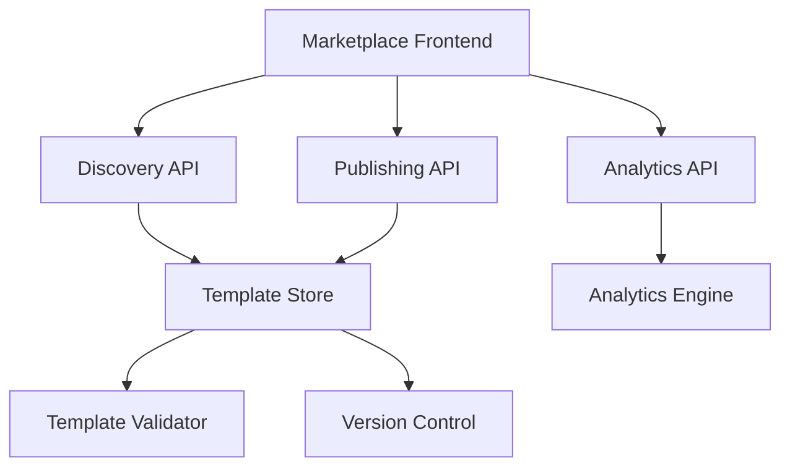
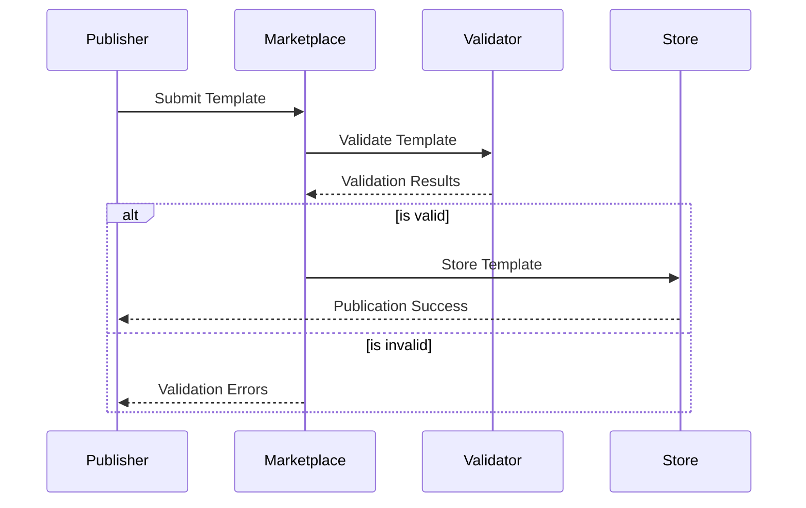

# Template Marketplace

## Overview

The Template Marketplace is a centralized platform for discovering, sharing, and monetizing workflow templates within the Auterity ecosystem. It enables dealerships to access industry-tested workflows, share their optimized processes, and leverage the collective expertise of the Auterity community.

## User Story

As a dealership process expert, I want to share our optimized workflows with other dealerships and discover best practices from the community, so we can continuously improve our operations and potentially generate additional revenue.

## Key Features

### 1. Template Discovery

#### Search & Browse
- Category navigation
- Smart search
- Filters and tags
- Popularity sorting
- Relevance ranking

#### Template Preview
- Visual workflow preview
- Feature highlights
- Use case examples
- Performance metrics
- User reviews

#### Recommendations
- Similar templates
- Popular in category
- Based on usage
- Industry specific
- AI-powered suggestions

### 2. Template Publishing

#### Publishing Tools
- Template validation
- Documentation builder
- Preview generation
- Version management
- Analytics dashboard

#### Quality Standards
- Code quality checks
- Documentation requirements
- Performance benchmarks
- Security validation
- Best practices compliance

### 3. Monetization

#### Pricing Models
- Free templates
- One-time purchase
- Subscription access
- Enterprise licensing
- Custom pricing

#### Revenue Sharing
- Publisher earnings
- Platform fees
- Enterprise agreements
- Referral programs
- Volume discounts

## Marketplace Architecture

### 1. Platform Structure



### 2. Data Models

```typescript
interface MarketplaceTemplate {
  id: string;
  name: string;
  version: string;
  publisher: Publisher;
  category: string;
  tags: string[];
  pricing: PricingModel;
  statistics: TemplateStats;
  content: WorkflowTemplate;
  documentation: Documentation;
  reviews: Review[];
  license: License;
}

interface Publisher {
  id: string;
  name: string;
  type: 'individual' | 'organization' | 'enterprise';
  reputation: {
    rating: number;
    templates_published: number;
    total_sales: number;
    member_since: string;
  };
  verification: {
    status: 'verified' | 'unverified';
    badges: string[];
  };
}

interface PricingModel {
  type: 'free' | 'paid' | 'subscription';
  price?: number;
  currency: string;
  billing_cycle?: 'monthly' | 'annual';
  trial_period?: number;
  enterprise_options?: {
    volume_discounts: boolean;
    custom_terms: boolean;
    support_level: string;
  };
}
```

## Publishing Process

### 1. Template Preparation

#### Documentation Requirements
```typescript
interface TemplateDocumentation {
  overview: {
    description: string;
    use_cases: string[];
    benefits: string[];
    requirements: string[];
  };
  setup_guide: {
    steps: SetupStep[];
    configuration: ConfigOption[];
    examples: Example[];
  };
  technical_specs: {
    performance_metrics: Metric[];
    dependencies: Dependency[];
    integration_points: Integration[];
  };
  support: {
    faq: FAQ[];
    troubleshooting: TroubleshootingGuide;
    contact: ContactInfo;
  };
}
```

#### Quality Checklist
```markdown
- [ ] Complete documentation
- [ ] Performance testing
- [ ] Security validation
- [ ] Code quality check
- [ ] Best practices review
```

### 2. Publishing Flow



### 3. Version Management

```typescript
interface VersionControl {
  version_number: string;
  changelog: {
    changes: Change[];
    breaking_changes: boolean;
    migration_guide?: string;
  };
  compatibility: {
    platform_version: string;
    dependencies: Dependency[];
  };
  rollback: {
    supported: boolean;
    procedure?: string;
  };
}
```

## Discovery Features

### 1. Search System

#### Search Configuration
```typescript
interface SearchConfig {
  indexes: {
    title: number;
    description: number;
    tags: number;
    content: number;
  };
  filters: {
    category: string[];
    price_range: Range;
    rating: number;
    compatibility: string[];
  };
  sorting: {
    field: string;
    direction: 'asc' | 'desc';
  };
}
```

#### Results Presentation
```typescript
interface SearchResults {
  templates: TemplatePreview[];
  facets: {
    categories: Facet[];
    tags: Facet[];
    price_ranges: Facet[];
  };
  pagination: {
    total: number;
    page: number;
    per_page: number;
  };
}
```

### 2. Recommendation Engine

```typescript
interface RecommendationEngine {
  algorithms: {
    collaborative_filtering: boolean;
    content_based: boolean;
    popularity_based: boolean;
  };
  context: {
    user_history: boolean;
    industry_trends: boolean;
    similar_users: boolean;
  };
  personalization: {
    industry: string;
    department: string;
    use_cases: string[];
  };
}
```

## Analytics & Reporting

### 1. Publisher Analytics

#### Performance Metrics
```typescript
interface PublisherAnalytics {
  sales: {
    revenue: number;
    units_sold: number;
    refund_rate: number;
  };
  usage: {
    active_instances: number;
    success_rate: number;
    error_rate: number;
  };
  engagement: {
    views: number;
    downloads: number;
    ratings: number;
  };
}
```

#### Usage Insights
```typescript
interface UsageInsights {
  user_segments: {
    industry: Distribution;
    company_size: Distribution;
    geography: Distribution;
  };
  performance: {
    execution_time: Metrics;
    resource_usage: Metrics;
    error_patterns: ErrorAnalysis;
  };
  feedback: {
    ratings: RatingDistribution;
    common_issues: Issue[];
    feature_requests: FeatureRequest[];
  };
}
```

### 2. Marketplace Analytics

```typescript
interface MarketplaceAnalytics {
  platform_metrics: {
    total_templates: number;
    active_publishers: number;
    monthly_transactions: number;
  };
  category_performance: {
    popular_categories: Category[];
    growth_trends: Trend[];
    conversion_rates: Rate[];
  };
  user_behavior: {
    search_patterns: Pattern[];
    browsing_paths: Path[];
    purchase_funnel: Funnel;
  };
}
```

## Best Practices

### 1. Template Publishing
- Comprehensive documentation
- Clear value proposition
- Quality code standards
- Regular updates
- Responsive support

### 2. Marketplace Participation
- Community engagement
- Feedback incorporation
- Version management
- Support provision
- Professional conduct

### 3. Template Usage
- Proper evaluation
- Test environment usage
- Customization planning
- Performance monitoring
- Update management

## Success Metrics

### 1. Platform Metrics
- Template quantity
- Publisher engagement
- User adoption
- Transaction volume
- Customer satisfaction

### 2. Template Metrics
- Download count
- Usage statistics
- Rating average
- Support tickets
- Revenue generation

### 3. User Metrics
- Search effectiveness
- Conversion rate
- Return visits
- Time to value
- Support utilization

## Support Resources

### Documentation
- [Publisher Guide](/docs/customer/marketplace/publisher-guide.md)
- [Template Standards](/docs/customer/marketplace/template-standards.md)
- [Monetization Guide](/docs/customer/marketplace/monetization-guide.md)
- [Analytics Guide](/docs/customer/marketplace/analytics-guide.md)

### Training
- Publishing workshops
- Quality standards
- Marketing strategies
- Analytics usage
- Support management

### Support
- Technical assistance
- Publishing guidance
- Analytics help
- Dispute resolution
- Community management

## Future Enhancements

### Planned Features
- Advanced analytics
- AI recommendations
- Enhanced search
- Mobile marketplace
- Social features

### Under Consideration
- Blockchain integration
- NFT templates
- Template bundles
- Subscription models
- Enterprise marketplace

## Maintenance & Updates

### 1. Platform Updates
- Feature enhancements
- Performance optimization
- Security updates
- UI/UX improvements
- API updates

### 2. Quality Control
- Template validation
- Code review
- Performance testing
- Security scanning
- Documentation review

### 3. Community Management
- User engagement
- Content moderation
- Dispute resolution
- Feedback collection
- Community building

---

*This documentation provides a comprehensive overview of the Template Marketplace feature. Regular updates will be made to reflect new capabilities and best practices.*
