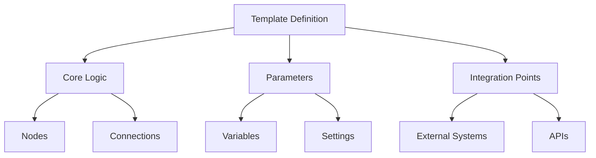
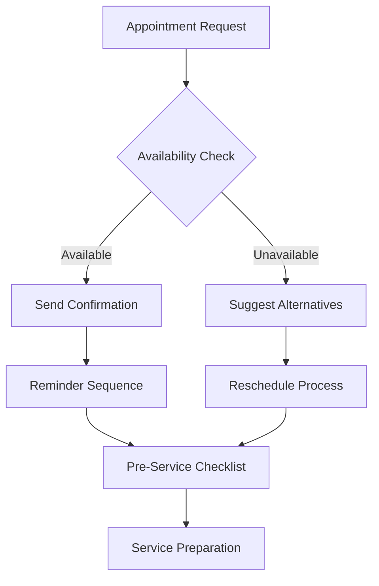
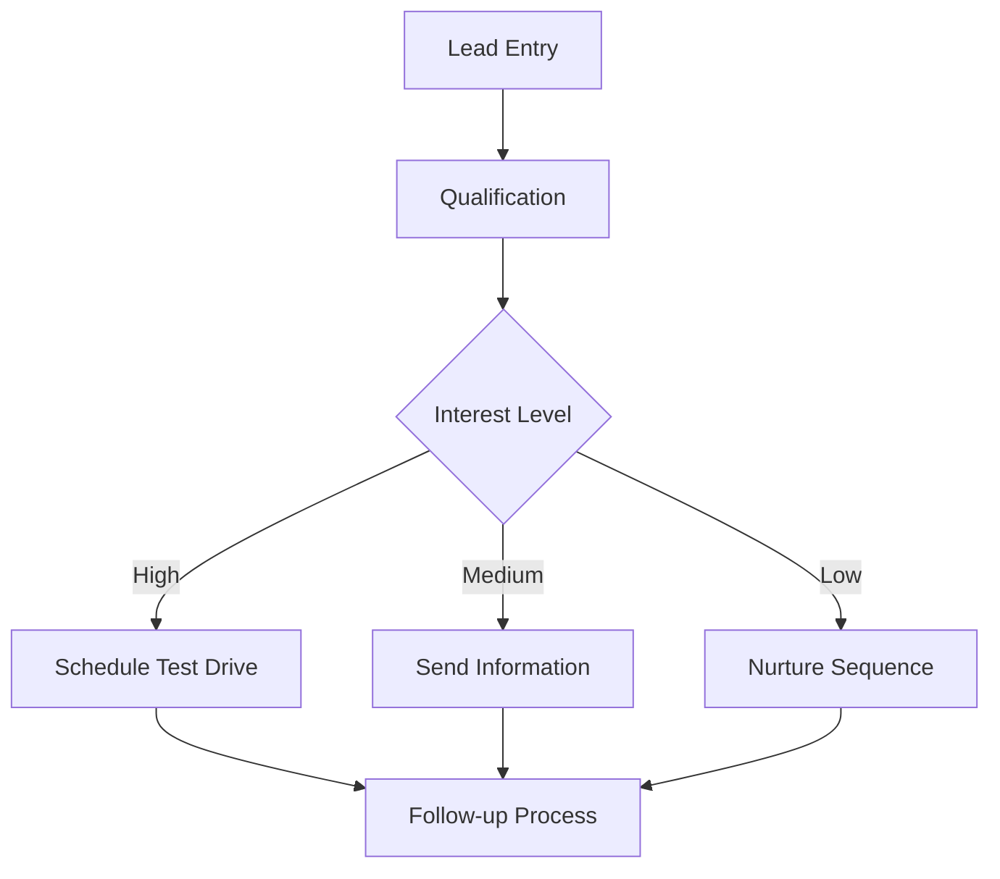
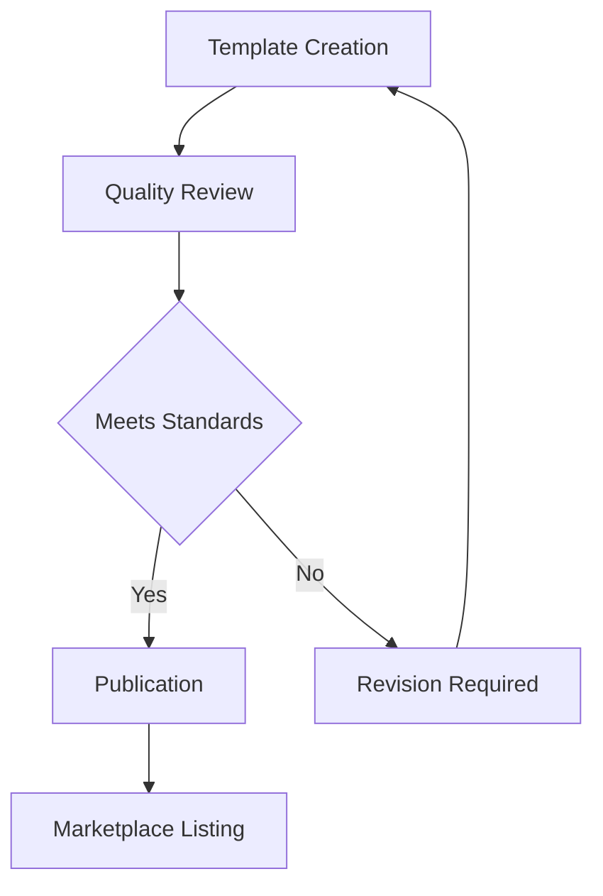

# Workflow Template Library

## Overview

The Workflow Template Library is a comprehensive collection of pre-built, customizable workflow templates designed specifically for automotive dealership operations. This feature enables rapid workflow deployment by providing industry-tested templates that can be easily customized to match specific business needs.

## User Story

As a dealership general manager, I want to quickly implement standardized workflows using pre-built templates, so I can ensure consistent processes across departments while saving time on workflow creation.

## Key Features

### 1. Template Categories

#### Customer Service
- Service Appointment Scheduling
- Follow-up Communications
- Customer Feedback Collection
- Issue Resolution Tracking
- Service History Management

#### Sales Operations
- Lead Qualification
- Sales Process Automation
- Inventory Updates
- Pricing Optimization
- Document Processing

#### Parts Management
- Inventory Tracking
- Order Processing
- Supplier Communication
- Stock Level Optimization
- Returns Handling

#### Administrative
- Employee Onboarding
- Document Management
- Compliance Tracking
- Reporting Automation
- Resource Scheduling

### 2. Template Management

#### Organization
- Category-based navigation
- Tag-based filtering
- Search functionality
- Favorites marking
- Usage statistics

#### Customization
- Parameter configuration
- Visual customization
- Business rule adaptation
- Integration settings
- Branding elements

#### Version Control
- Template versioning
- Change tracking
- Rollback capability
- Update management
- Dependency tracking

## Template Structure

### 1. Component Architecture



### 2. Template Schema

```typescript
interface WorkflowTemplate {
  id: string;
  name: string;
  version: string;
  category: string;
  tags: string[];
  description: string;
  parameters: TemplateParameter[];
  workflow: WorkflowDefinition;
  integrations: Integration[];
  documentation: Documentation;
  metadata: Metadata;
}

interface TemplateParameter {
  name: string;
  type: 'string' | 'number' | 'boolean' | 'select';
  label: string;
  description: string;
  required: boolean;
  default_value?: any;
  validation_rules?: ValidationRule[];
}

interface Documentation {
  overview: string;
  setup_guide: string;
  best_practices: string[];
  examples: Example[];
  faq: FAQ[];
}
```

## Template Examples

### 1. Service Appointment Workflow



#### Key Features
- Automated scheduling
- Customer communication
- Resource allocation
- Follow-up management

### 2. Vehicle Sales Process



#### Key Features
- Lead scoring
- Communication automation
- Task assignment
- Progress tracking

## Implementation Guide

### 1. Template Selection

#### Selection Criteria
- Business requirements alignment
- Process complexity
- Integration needs
- Customization requirements
- Resource availability

#### Evaluation Checklist
```markdown
- [ ] Process requirements documented
- [ ] Integration points identified
- [ ] Resource availability confirmed
- [ ] Timeline established
- [ ] Success metrics defined
```

### 2. Customization Process

#### Steps
1. Parameter configuration
2. Integration setup
3. Business rule adaptation
4. Testing and validation
5. Deployment and monitoring

#### Best Practices
- Document all customizations
- Test thoroughly before deployment
- Train users on customized workflow
- Monitor performance metrics
- Regular review and optimization

## Success Metrics

### 1. Implementation Metrics
- Template adoption rate
- Customization time
- Deployment success rate
- User training completion
- Initial performance metrics

### 2. Operational Metrics
- Process completion time
- Error reduction
- Resource utilization
- Cost savings
- User satisfaction

### 3. Business Impact
- Customer satisfaction
- Employee productivity
- Process consistency
- Compliance adherence
- ROI measurement

## Template Marketplace

### 1. Marketplace Features
- Template discovery
- Ratings and reviews
- Usage statistics
- Community contributions
- Version tracking

### 2. Quality Standards
- Code quality requirements
- Documentation standards
- Testing requirements
- Security guidelines
- Performance benchmarks

### 3. Contribution Process


## Best Practices

### 1. Template Selection
- Assess business requirements
- Review available templates
- Evaluate customization needs
- Consider integration requirements
- Plan implementation timeline

### 2. Customization
- Document modifications
- Test thoroughly
- Train users
- Monitor performance
- Regular updates

### 3. Management
- Version control
- Change documentation
- User feedback collection
- Performance monitoring
- Regular optimization

## Support Resources

### Documentation
- [Template Guide](/docs/customer/tutorials/template-guide.md)
- [Customization Guide](/docs/customer/tutorials/template-customization.md)
- [Best Practices](/docs/customer/tutorials/template-best-practices.md)
- [Integration Guide](/docs/system/integration.md)

### Training
- Template workshops
- Customization training
- Implementation guides
- Best practices sessions
- Advanced techniques

### Support
- Technical assistance
- Implementation support
- Performance optimization
- Custom development
- Training resources

## Future Enhancements

### Planned Features
- Advanced customization tools
- Enhanced template search
- Integration expansion
- Performance optimization
- Analytics dashboard

### Under Consideration
- AI-powered template suggestions
- Advanced version control
- Template combination tools
- Performance prediction
- Automated optimization

## Maintenance & Updates

### 1. Regular Updates
- Security patches
- Feature enhancements
- Performance improvements
- Bug fixes
- Documentation updates

### 2. Version Management
- Update notifications
- Compatibility checking
- Migration assistance
- Rollback procedures
- Change documentation

### 3. Quality Assurance
- Automated testing
- Performance monitoring
- Security scanning
- User feedback analysis
- Continuous improvement

---

*This documentation provides a comprehensive overview of the Workflow Template Library feature. Regular updates will be made to reflect new templates, features, and best practices.*
