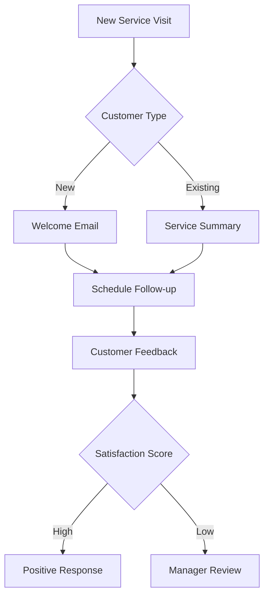
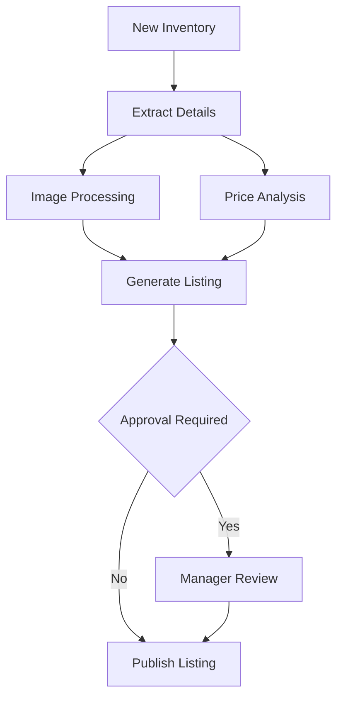

# Visual Workflow Builder

## Overview

The Visual Workflow Builder is the core feature of Auterity's Workflow Studio, enabling users to create, edit, and manage complex automation workflows through an intuitive drag-and-drop interface. Built on a high-performance canvas powered by PixiJS, it provides enterprise-grade workflow design capabilities with real-time collaboration features.

## User Story

As a dealership operations manager, I want to create and customize automated workflows visually, so I can streamline our business processes without writing code or requiring technical expertise.

## Key Features

### 1. Drag-and-Drop Interface
- **Node Palette**: 20+ pre-built node types for common automation tasks
- **Smart Connections**: Automatic path routing and connection validation
- **Visual Feedback**: Real-time validation and error indicators
- **Intuitive Layout**: Automatic node arrangement and spacing

### 2. Node Types

#### AI Processing Nodes
- Text Analysis
- Image Recognition
- Document Processing
- Natural Language Generation
- Sentiment Analysis

#### Logic & Control Nodes
- Decision Points
- Conditional Branching
- Loops and Iterations
- Parallel Processing
- Merge Points

#### Data Transformation Nodes
- Field Mapping
- Data Filtering
- Format Conversion
- Validation Rules
- Aggregation

#### Integration Nodes
- API Connectors
- Database Operations
- Email/SMS Actions
- File Operations
- External Services

### 3. Canvas Features
- **Infinite Canvas**: Pan and zoom for large workflows
- **Minimap Navigation**: Quick workflow overview and navigation
- **Multi-select**: Bulk operations on nodes and connections
- **Copy/Paste**: Duplicate workflow sections with dependencies
- **Undo/Redo**: Full action history support

### 4. Property Configuration
- **Node Settings**: Contextual property panels
- **Dynamic Forms**: Input validation and type checking
- **Variable Management**: Workflow-level variable definition
- **Template Parameters**: Customizable workflow inputs
- **Documentation**: Inline help and examples

## Technical Specifications

### Performance Targets
- Support for workflows with 500+ nodes
- 60 FPS canvas performance
- Sub-100ms node operation response time
- Real-time collaboration with <50ms latency

### Browser Support
- Chrome 80+
- Firefox 75+
- Safari 13+
- Edge 80+

### Hardware Requirements
- Minimum: 4GB RAM, integrated graphics
- Recommended: 8GB RAM, dedicated graphics
- Storage: 50MB for application cache

## User Interface

### Canvas Layout
```
+----------------------------------+
|  Toolbar                         |
+--------+------------------------+
| Node   |                        |
| Palette|     Canvas Area        |
|        |                        |
|        |                        |
+--------+------------------------+
|  Properties Panel               |
+----------------------------------+
```

### Keyboard Shortcuts
| Action | Windows/Linux | macOS |
|--------|---------------|-------|
| Pan | Space + Drag | Space + Drag |
| Zoom | Ctrl + Scroll | Cmd + Scroll |
| Select All | Ctrl + A | Cmd + A |
| Copy | Ctrl + C | Cmd + C |
| Paste | Ctrl + V | Cmd + V |
| Undo | Ctrl + Z | Cmd + Z |
| Redo | Ctrl + Shift + Z | Cmd + Shift + Z |
| Delete | Delete | Delete |
| Save | Ctrl + S | Cmd + S |

## Workflow Examples

### 1. Customer Service Follow-up


### 2. Inventory Processing


## Success Metrics

### User Engagement
- Average workflow creation time
- Node type usage distribution
- Template utilization rate
- Collaboration session duration

### Performance
- Canvas render time
- Operation response time
- Memory utilization
- WebGL performance metrics

### Business Impact
- Workflow execution success rate
- Time saved per automated process
- Error reduction percentage
- User satisfaction scores

## Best Practices

### Workflow Design
1. Start with a template when possible
2. Use clear node names and descriptions
3. Group related nodes visually
4. Include error handling paths
5. Document complex logic

### Performance Optimization
1. Break large workflows into sub-workflows
2. Use template parameters for flexibility
3. Implement proper error handling
4. Regular workflow testing and validation
5. Monitor execution metrics

### Collaboration
1. Use real-time comments for communication
2. Review changes before saving
3. Maintain consistent naming conventions
4. Document significant changes
5. Use version control for major updates

## Future Enhancements

### Planned Features
- Advanced AI node types
- Custom node creation
- Workflow versioning system
- Enhanced debugging tools
- Performance optimization tools

### Under Consideration
- Mobile workflow viewer
- 3D workflow visualization
- AR/VR integration
- Workflow simulation
- AI-powered optimization

## Support Resources

### Documentation
- [User Guide](/docs/customer/getting-started.md)
- [API Reference](/docs/system/api-contracts.md)
- [Best Practices Guide](/docs/customer/tutorials/workflow-best-practices.md)
- [Troubleshooting Guide](/docs/customer/troubleshooting.md)

### Training
- Interactive tutorials
- Video guides
- Webinar sessions
- Certification program

### Community
- User forums
- Knowledge base
- Feature requests
- Bug reporting

---

*This documentation provides a comprehensive overview of the Visual Workflow Builder feature. Regular updates will be made to reflect new capabilities and best practices.*
