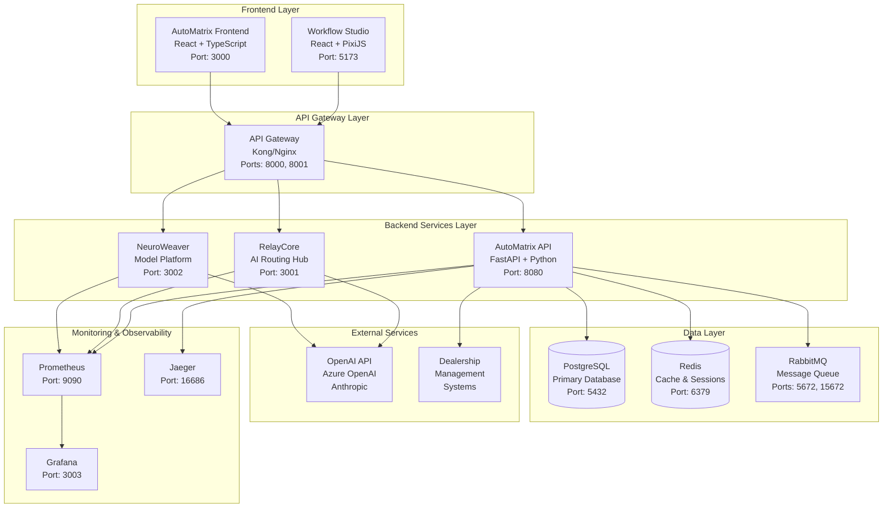
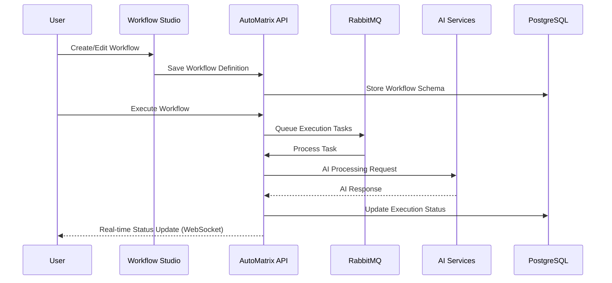
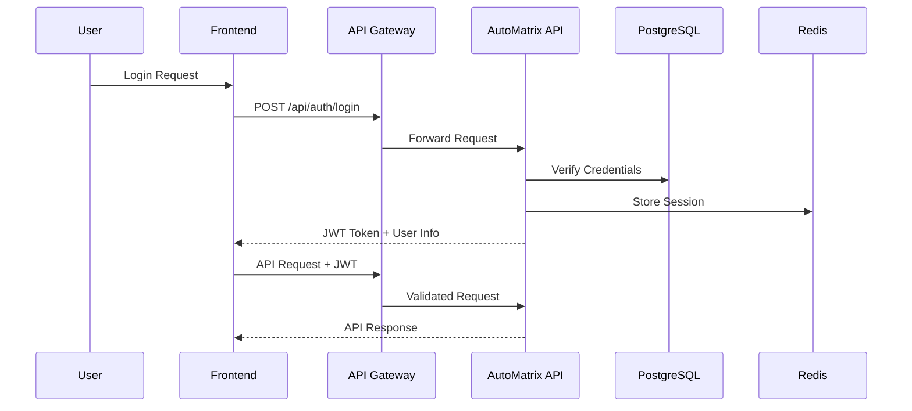

# System Architecture Overview

## Executive Summary

The Auterity Unified AI Platform is a comprehensive, containerized microservices architecture designed for automotive dealership workflow automation. The system consists of two primary applications - AutoMatrix (core workflow engine) and Workflow Studio (visual designer) - built on modern cloud-native technologies with enterprise-grade security, scalability, and observability.

## High-Level Architecture

## Component Architecture

### 1. Frontend Applications

#### AutoMatrix Frontend (auterity-error-iq/frontend)
- **Technology**: React 18 + TypeScript + Vite
- **Purpose**: Main user interface for workflow management
- **Port**: 3000 (development), 80/443 (production)
- **Key Features**:
  - Workflow dashboard and monitoring
  - Template library management
  - User authentication and authorization
  - Real-time notifications via WebSocket
  - Analytics and reporting interfaces

#### Workflow Studio (auterity-workflow-studio)
- **Technology**: React 18 + TypeScript + PixiJS + Vite
- **Purpose**: Visual workflow designer and canvas interface
- **Port**: 5173 (development), integrated via reverse proxy (production)
- **Key Features**:
  - High-performance 2D canvas rendering
  - Drag-and-drop workflow builder
  - Real-time collaborative editing (YJS)
  - AI-powered workflow assistance
  - Advanced node types and logic flows

### 2. Backend Services

#### AutoMatrix API (auterity-error-iq/backend)
- **Technology**: FastAPI + Python 3.11 + SQLAlchemy
- **Purpose**: Core workflow automation engine
- **Port**: 8080
- **Responsibilities**:
  - User authentication and authorization (JWT)
  - Workflow definition, execution, and monitoring
  - Template management system
  - Task execution with retry mechanisms
  - Real-time WebSocket notifications
  - Integration APIs for external systems

#### RelayCore (AI Routing Hub)
- **Technology**: Express.js + Node.js
- **Purpose**: AI request routing and cost optimization
- **Port**: 3001
- **Responsibilities**:
  - Multi-provider AI model routing
  - Cost optimization and usage tracking
  - Rate limiting and quota management
  - Provider failover and load balancing

#### NeuroWeaver (Model Specialization Platform)
- **Technology**: FastAPI + Python + MLflow
- **Purpose**: Custom AI model training and deployment
- **Port**: 3002
- **Responsibilities**:
  - Model registry and versioning
  - Training job orchestration
  - Performance monitoring and A/B testing
  - Model deployment and inference

### 3. Data Layer

#### PostgreSQL Database
- **Version**: 14+
- **Purpose**: Primary transactional database
- **Port**: 5432
- **Schema Components**:
  - User management (users, organizations, roles)
  - Workflow definitions (workflows, tasks, executions)
  - Template system (templates, variables, configurations)
  - Audit logs and metrics
  - AI model metadata and training records

#### Redis Cache
- **Version**: 7+
- **Purpose**: Caching and session management
- **Port**: 6379
- **Use Cases**:
  - Session storage and user authentication
  - Workflow execution state caching
  - Real-time collaboration state (YJS documents)
  - Rate limiting and API throttling
  - Background job queue management

#### RabbitMQ Message Queue
- **Version**: 3.11+
- **Purpose**: Asynchronous task processing
- **Ports**: 5672 (AMQP), 15672 (Management UI)
- **Use Cases**:
  - Workflow execution orchestration
  - AI processing job queues
  - Email and notification delivery
  - Event-driven architecture messaging

### 4. Infrastructure Components

#### API Gateway (Kong/Nginx)
- **Purpose**: Request routing, load balancing, and security
- **Ports**: 8000 (proxy), 8001 (admin), 80/443 (production)
- **Features**:
  - Path-based routing to backend services
  - SSL termination and certificate management
  - Rate limiting and API key management
  - Request/response transformation
  - Circuit breaker patterns

#### Container Orchestration
- **Development**: Docker Compose with unified configuration
- **Production**: Kubernetes with Helm charts
- **Features**:
  - Auto-scaling based on CPU/memory metrics
  - Rolling updates with zero downtime
  - Health checks and automatic restart
  - Resource limits and quality of service

### 5. Monitoring & Observability

#### Prometheus (Metrics Collection)
- **Port**: 9090
- **Metrics**:
  - Application performance metrics
  - Infrastructure resource utilization
  - Business metrics (workflow executions, user activity)
  - Custom metrics from each service

#### Grafana (Visualization)
- **Port**: 3003
- **Dashboards**:
  - System health and performance
  - Application-specific metrics
  - Business intelligence dashboards
  - Alert management and notifications

#### Jaeger (Distributed Tracing)
- **Port**: 16686
- **Capabilities**:
  - End-to-end request tracing
  - Performance bottleneck identification
  - Service dependency mapping
  - Error tracking and debugging

## Data Flow Architecture

### 1. Workflow Execution Flow

### 2. Authentication & Authorization Flow

## Security Architecture

### 1. Authentication & Authorization
- **JWT-based authentication** with refresh token rotation
- **Role-based access control (RBAC)** with granular permissions
- **Multi-factor authentication (MFA)** support for enterprise accounts
- **OAuth2/OIDC integration** for enterprise SSO

### 2. API Security
- **API key management** with rate limiting and quotas
- **Request validation** with Pydantic schemas
- **CORS configuration** with allowed origins
- **Input sanitization** and SQL injection prevention

### 3. Data Protection
- **Encryption at rest** for sensitive database fields
- **TLS/SSL encryption** for all network communication
- **Secrets management** with environment variables and Kubernetes secrets
- **Data masking** in logs and non-production environments

### 4. Infrastructure Security
- **Container image scanning** for vulnerabilities
- **Network segmentation** with service mesh (Istio)
- **Security policies** with Open Policy Agent (OPA)
- **Compliance monitoring** with automated security audits

## Scalability & Performance

### 1. Horizontal Scaling
- **Stateless application design** for easy horizontal scaling
- **Load balancing** with health checks and graceful degradation
- **Database read replicas** for query optimization
- **CDN integration** for static asset delivery

### 2. Performance Optimization
- **Database indexing** for critical query paths
- **Redis caching** for frequently accessed data
- **Async processing** for long-running tasks
- **Connection pooling** for database efficiency
- **Lazy loading** and pagination for large datasets

### 3. Resource Management
- **Container resource limits** and requests
- **Auto-scaling policies** based on metrics
- **Quality of Service (QoS)** classes for workload prioritization
- **Resource quotas** and limits at namespace level

## Deployment Architecture

### 1. Development Environment
- **Docker Compose** for local development with hot reloading
- **Test databases** with sample data and migrations
- **Mock external services** for isolated testing
- **Debugging tools** and development utilities

### 2. Staging Environment
- **Production-like infrastructure** for integration testing
- **Blue-green deployment** for risk-free updates
- **Automated testing** including E2E and performance tests
- **Data migration testing** and rollback procedures

### 3. Production Environment
- **Kubernetes cluster** with high availability
- **Multi-zone deployment** for disaster recovery
- **Automated monitoring** and alerting
- **Backup and restore** procedures

## Integration Points

### 1. External AI Services
- **OpenAI API** (GPT-3.5/GPT-4) for general language processing
- **Azure OpenAI** for enterprise customers requiring data residency
- **Anthropic Claude** for specific use cases requiring constitutional AI
- **Custom model endpoints** via NeuroWeaver platform

### 2. Dealership Management Systems
- **REST API integrations** with common DMS platforms
- **Webhook support** for real-time event processing
- **Data synchronization** with customer and inventory systems
- **Custom connector framework** for proprietary systems

### 3. Communication Channels
- **Email providers** (SendGrid, AWS SES) for notifications
- **SMS gateways** (Twilio, AWS SNS) for alerts
- **Push notifications** for mobile and web applications
- **Webhook endpoints** for external system notifications

## Disaster Recovery & Business Continuity

### 1. Backup Strategy
- **Automated database backups** with point-in-time recovery
- **Configuration backups** for infrastructure as code
- **Application state snapshots** for rapid recovery
- **Cross-region replication** for critical data

### 2. Failover Procedures
- **Multi-zone deployment** for automatic failover
- **Health checks** and automatic service restart
- **Circuit breaker patterns** for graceful degradation
- **Manual override procedures** for emergency situations

### 3. Recovery Objectives
- **Recovery Time Objective (RTO)**: < 4 hours for critical services
- **Recovery Point Objective (RPO)**: < 1 hour for data loss
- **Service Level Agreement (SLA)**: 99.9% uptime for production
- **Business continuity planning** with regular testing and updates

---

*This architecture documentation provides the foundation for understanding, maintaining, and scaling the Auterity Unified AI Platform. Regular updates to this document should accompany significant architectural changes or technology upgrades.*
